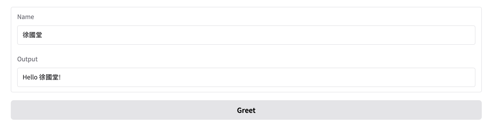
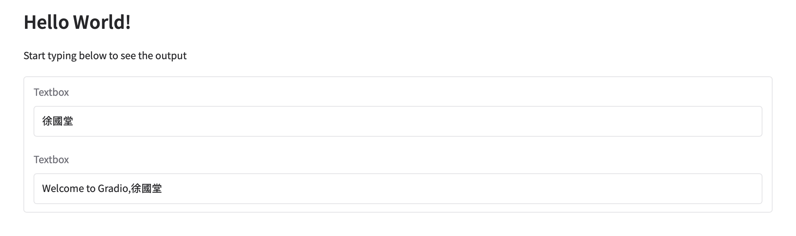
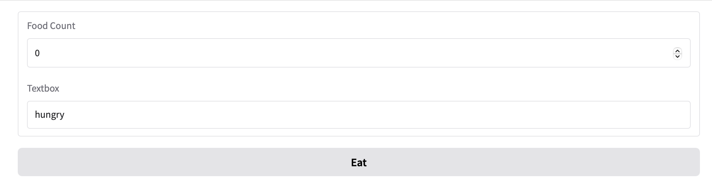
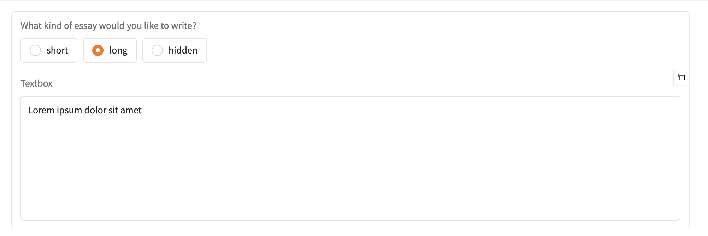
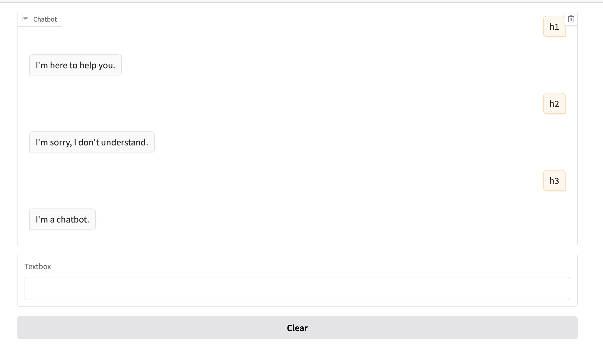
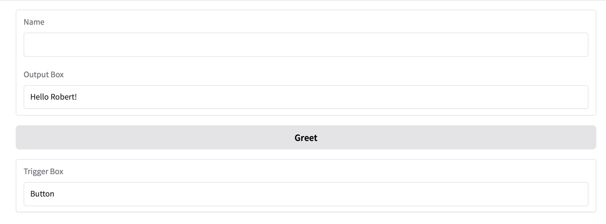

# 🧱 Blocks 基礎與事件監聽者

當您需要比 `gr.Interface` 更有彈性的排版與複雜的資料流控制時，`gr.Blocks` 是最佳選擇。本章將帶您深入了解 Blocks 的基本結構、事件監聽機制以及多組件的互動。

---

## 🛠️ 1. Blocks 的基本結構

您可以使用兩種方式來宣告 Blocks 應用程式：**傳統的 with 區塊結構** 與 **Decorator (裝飾器) 語法**。

### 方式 A：傳統 with 結構 (推薦)
這是最直覺的方式，將組件與監聽邏輯分開定義，程式碼結構非常清晰：

```python
import gradio as gr

def greet(name):
    return "Hello " + name + "!"

with gr.Blocks() as demo:
    name = gr.Textbox(label="您的姓名")
    output = gr.Textbox(label="輸出結果")
    greet_btn = gr.Button("送出問候")
    
    # 綁定點擊事件
    greet_btn.click(fn=greet, inputs=name, outputs=output, api_name="greet")

demo.launch()
```

### 方式 B：裝飾器 (Decorator) 語法
您也可以直接在處理函數上方使用 `@component.click` 裝飾器來綁定事件：

```python
import gradio as gr

with gr.Blocks() as demo:
    name = gr.Textbox(label="您的姓名")
    output = gr.Textbox(label="輸出框")
    greet_btn = gr.Button("送出問候")

    @greet_btn.click(inputs=name, outputs=output)
    def greet(name):
        return "Hello " + name + "!"

demo.launch()
```

*執行後的網頁介面如下：*



---

## 🔄 2. 事件監聽者與元件互動

### 組件的互動屬性 (`interactive`)
- 當組件被指定為 **`inputs`** 時，預設為**可與使用者互動**（如可輸入文字的 Textbox）。
- 當組件被指定為 **`outputs`** 時，預設為**不可與使用者互動**（僅用於顯示結果的 Textbox）。
- 您可以顯式地使用 `interactive=True` 來強制讓輸出組件保持可編輯狀態：
  ```python
  output = gr.Textbox(label="輸出結果", interactive=True)
  ```

### 常用事件監聽 (例如 `change`)
除了常見的 `click` 外，許多組件都支援多樣的事件。例如 Textbox 支援 `change`（當內容改變時立即觸發）：

```python
import gradio as gr

def welcome(name):
    return f"歡迎來到 Gradio, {name}！"

with gr.Blocks() as demo:
    gr.Markdown("# 👋 歡迎頁面\n請在下方輸入您的姓名，輸出將即時更新：")
    inp = gr.Textbox(placeholder="您叫什麼名字？")
    out = gr.Textbox(label="即時歡迎詞")
    
    # 只要輸入內容改變，就會即時觸發 welcome 函數
    inp.change(welcome, inp, out)

demo.launch()
```



> [!TIP]
> 各組件所支援的完整事件列表（如 `submit`, `focus`, `blur` 等），請參閱 [Gradio 官方組件文件](https://www.gradio.app/docs/gradio/button#event-listeners)。

---

## 🔀 3. 多個資料流與複雜配置

在一個 Blocks 應用中，您可以配置多個事件按鈕與多個獨立的資料傳遞管道。

### 範例：雙向加值器

```python
import gradio as gr

def increase(num):
    return num + 1

with gr.Blocks() as demo:
    a = gr.Number(label="數值 A")
    b = gr.Number(label="數值 B")
    atob = gr.Button("將 A 的值加 1 後填入 B")
    btoa = gr.Button("將 B 的值加 1 後填入 A")
    
    # 兩個獨立的點擊事件流
    atob.click(increase, inputs=a, outputs=b)
    btoa.click(increase, inputs=b, outputs=a)

demo.launch()
```


---

## 🗂️ 4. 監聽函數的輸入格式：List vs Set

當事件監聽器綁定了多個輸入組件時，您有兩種方式在 Python 函數中接收這些參數：

### 方式 A：使用 List (以位置對應)
這是最常用的方式。傳入參數的順序與數量必須與 inputs 列表完全一致。
```python
# inputs=[a, b] 對應到 add(num1, num2)
add_btn.click(add, inputs=[a, b], outputs=c)
```

### 方式 B：使用 Set (以 Dict 鍵值對應)
當您將 inputs 包裝在 Set（大括號 `{}`）中時，Gradio 會將組件物件作為 key，組件當下的值作為 value，包裝成一個 Dict 傳遞給函數。這在輸入組件非常多時特別好用：
```python
def sub(data):
    # data 是一個 dictionary，用組件變數作為 key 來存取其值
    return data[a] - data[b]

sub_btn.click(sub, inputs={a, b}, outputs=c)
```

---

## 📦 5. 輸出至多個組件 (Return List)

若您的 Python 函數會產出多個結果，並需要更新多個不同的組件，可以讓函數回傳一個 **Tuple**，並在 `outputs` 傳入對應的組件 **List**：

```python
import gradio as gr

with gr.Blocks() as demo:
    food_box = gr.Number(value=10, label="剩餘食物數量")
    status_box = gr.Textbox(label="寵物狀態")

    def eat(food):
        if food > 0:
            return food - 1, "飽足 😋"
        else:
            return 0, "飢餓 😢"
        
    gr.Button("餵食").click(
        fn=eat,
        inputs=food_box,
        outputs=[food_box, status_box] # 同時更新食物數量與狀態
    )

demo.launch()
```



---

## ⚙️ 6. 動態更新組件的屬性

Gradio 允許我們在事件觸發時，動態改變其他組件的配置屬性（例如：可見度 `visible`、行數 `lines`、甚至預設值 `value`）。我們只需在函數中回傳對應組件類別的實例即可：

```python
import gradio as gr

def change_textbox(choice):
    if choice == "短文模式":
        return gr.Textbox(lines=2, visible=True, label="短文寫作")
    elif choice == "長文模式":
        return gr.Textbox(lines=8, visible=True, value="請在此開始撰寫長文...", label="長文寫作")
    else:
        return gr.Textbox(visible=False) # 隱藏該組件
    
with gr.Blocks() as demo:
    radio = gr.Radio(
        ["短文模式", "長文模式", "隱藏"],
        label="請選擇寫作模式"
    )
    text = gr.Textbox(lines=2, interactive=True, show_copy_button=True)
    
    radio.change(
        fn=change_textbox,
        inputs=radio,
        outputs=text
    )

demo.launch()
```



---

## 🚫 7. 保持組件原值不變 (`gr.skip()`)

在某些情況下，您可能只想更新 outputs 列表中的某幾個組件，而讓其他組件保持原樣。此時可以使用 `gr.skip()`：

```python
import random
import gradio as gr

with gr.Blocks() as demo:
    with gr.Row():
        clear_button = gr.Button("清除")
        skip_button = gr.Button("跳過 A (保持原狀)")
        random_button = gr.Button("隨機產生")
    numbers = [gr.Number(label="數值 A"), gr.Number(label="數值 B")]

    # 1. 全部清空為 None
    clear_button.click(lambda: (None, None), outputs=numbers)
    # 2. B 填入 "已跳過"，但 A 保持原本的數值
    skip_button.click(lambda: [gr.skip(), "已跳過"], outputs=numbers)
    # 3. 隨機產生兩個新數值
    random_button.click(lambda: (random.randint(0, 100), random.randint(0, 100)), outputs=numbers)

demo.launch()
```

---

## ⛓️ 8. 連續執行事件 (Consecutive Events with `.then()`)

使用 `.then()` 可以將多個事件串聯在一起。當前一個事件執行完畢後，會自動接著觸發下一個事件。這非常適合用在聊天機器人的交互設計中（例如：使用者點擊送出後先清空文字框，接著讓機器人開始打字回覆）：

```python
import gradio as gr
import random
import time

with gr.Blocks() as demo:
    chatbot = gr.Chatbot(label="對話視窗")
    msg = gr.Textbox(label="請輸入您的訊息")
    clear = gr.Button("清空對話")

    def user_action(user_message, history):
        # 先將使用者的話加入對話歷史，並清空輸入框
        return "", history + [[user_message, None]]
    
    def bot_action(history):
        bot_message = random.choice(["你好！有什麼我可以幫忙的？", "這是一個 Blocks 範例。", "很高興為您服務。"])
        time.sleep(1.5) # 模擬思考時間
        history[-1][1] = bot_message
        return history
    
    # 點擊送出或按下 Enter 後：
    # 1. 執行 user_action (清空輸入框，顯示使用者訊息)
    # 2. 緊接著執行 bot_action (模擬機器人回覆)
    msg.submit(fn=user_action, inputs=[msg, chatbot], outputs=[msg, chatbot], queue=False).then(
        fn=bot_action,
        inputs=chatbot,
        outputs=chatbot
    )
    clear.click(lambda: None, None, outputs=chatbot, queue=False)

demo.launch()
```



---

## 🎛️ 9. 多組件事件綁定 (`gr.on()`)

若您有多個組件的事件需要執行同一個 Python 函數，不需要重複寫好幾次綁定。可以使用 `gr.on()` 語法一次將它們鏈結起來：

```python
import gradio as gr

with gr.Blocks() as demo:
    name = gr.Textbox(label="姓名輸入框")
    greet_btn = gr.Button("點此問候")
    output = gr.Textbox(label="問候語輸出")
    trigger_source = gr.Textbox(label="事件觸發來源")

    def greet(name, evt_data: gr.EventData):
        # evt_data 可以取得觸發事件的元件資訊
        source_name = evt_data.target.__class__.__name__
        return "Hello " + name + "!", f"觸發自：{source_name}"
    
    def clear_name(evt_data: gr.EventData):
        return ""
    
    # name.submit (在文字框按下 Enter) 或 greet_btn.click (點擊按鈕) 都會觸發同一個事件
    gr.on(
        triggers=[name.submit, greet_btn.click],
        fn=greet,
        inputs=name,
        outputs=[output, trigger_source]
    ).then(clear_name, outputs=[name]) # 執行完後自動清空姓名輸入框

demo.launch()
```




