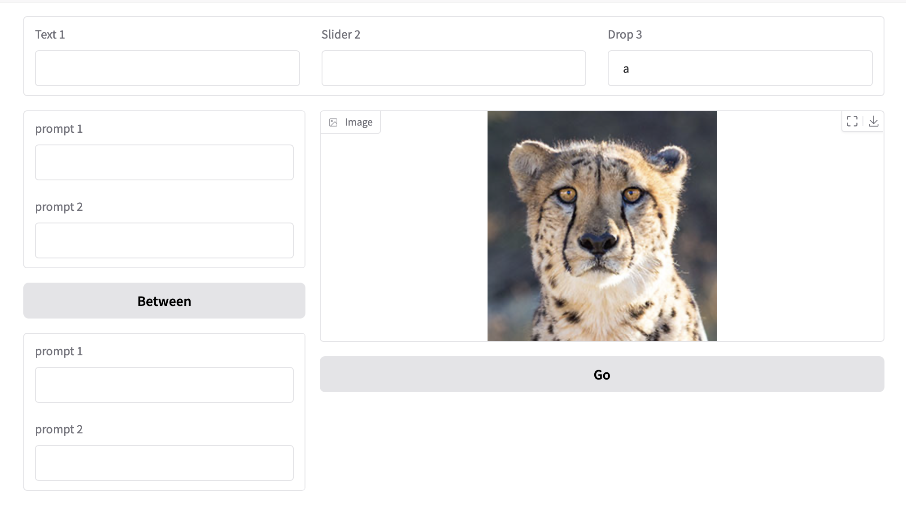
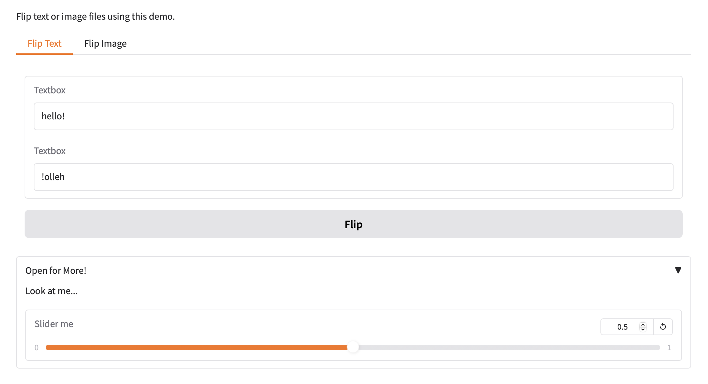
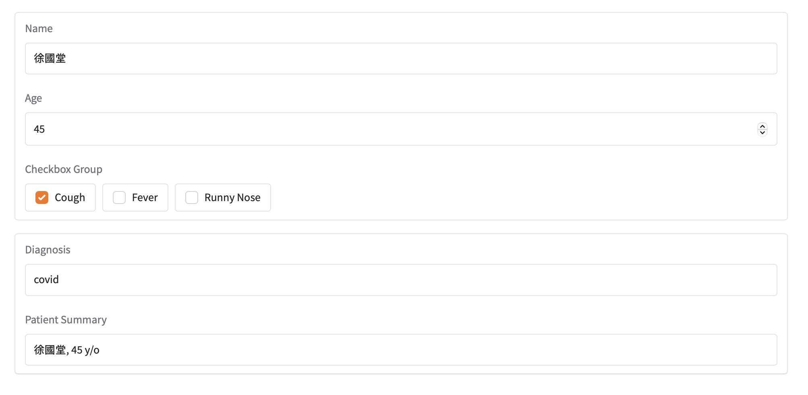

## 版面控制(Controlling Layout)

### 列(Rows)
- with gr.Row()

**顯示2欄**

```python
with gr.Blocks() as demo:
		with gr.Row():
				btn1 = gr.Button("Button 1")
				btn2 = gr.Button("Button 2")
```

```python
with gr.Blocks() as demo:
		with gr.Row(equal_height=True):
			textbox = gr.Textbox()
			btn2 = gr.Button("Button 2")
```

## 欄位的寬度
- scale=0,不會擴充
- scale=1,擴充一點
- scale=2,擴充多一點
- min_width

```python
with gr.Blocks() as demo:
		with gr.Row():
				btn0 = gr.Button("Button 0", scale=0)
				btn1 = gr.Button("Button 1", scale=1)
				btn2 = gr.Button("Button 2", scale=2)
```

## 巢狀欄位

```python
import gradio as gr

with gr.Blocks() as demo:
    with gr.Row():
        text1 = gr.Textbox(label="Text 1")
        slider2 = gr.Textbox(label="Slider 2")
        drop3 = gr.Dropdown(label="Drop 3", choices=["a", "b", "c"])
    
    with gr.Row():
        with gr.Column(scale=1, min_width=300):
            text1 = gr.Textbox(label="prompt 1")
            text2 = gr.Textbox(label="prompt 2")
            inbtw = gr.Button("Between")
            text4 = gr.Textbox(label="prompt 1")
            text5 = gr.Textbox(label="prompt 2") 
        
        with gr.Column(scale=2, min_width=300):
            img1 = gr.Image("cheetah.jpg")
            btn = gr.Button("Go")

demo.launch()
```



## 填滿瀏覽器的寬和高

```python
import gradio a gr

with gr.Blocks(fill_height=True) as demo:
	gr.Chatbot(scale=1)
	gr.Textbox(scale=0)
	
```

## 尺寸(Dimensions)

```python
import gradio as gr

with gr.Blocks() as demo:
	im = gr.ImageEditor(width="50vw")

demo.launch()
```

## Tabs and Accordions

```python
# tabs and Accordions

import numpy as np
import gradio as gr

def flip_text(x):
    return x[::-1]

def flip_image(x):
    return np.fliplr(x)

with gr.Blocks() as demo:
    gr.Markdown("Flip text or image files using this demo.")
    with gr.Tab("Flip Text"):
        text_input = gr.Textbox()
        text_output = gr.Textbox()
        text_button = gr.Button("Flip")
    
    with gr.Tab("Flip Image"):
        with gr.Row():
            image_input = gr.Image()
            image_output = gr.Image()
        
        image_button = gr.Button("Flip")

    with gr.Accordion("Open for More!", open=False):
        gr.Markdown("Look at me...")
        temp_slider = gr.Slider(
            0, 1, 
            value=0.1,
            step=0.1,
            interactive=True,
            label="Slider me"
        )

    text_button.click(flip_text, inputs=text_input, outputs=text_output)
    image_button.click(flip_image, inputs=image_input, outputs=image_output)

demo.launch()
```



## 顯示

```python
import gradio as gr

with gr.Blocks() as demo:
    name_box = gr.Textbox(label="Name")
    age_box = gr.Number(label="Age",minimum=0, maximum=100)
    symptoms_box = gr.CheckboxGroup(["Cough", "Fever", "Runny Nose"])
    submit_btn = gr.Button("Submit")

    with gr.Column(visible=False) as output_col:
        diagnosis_box = gr.Textbox(label="Diagnosis")
        patient_summary_box = gr.Textbox(label="Patient Summary")
    
    def submit(name, age, symptoms):
        return {
            submit_btn: gr.Button(visible=False),            
            diagnosis_box: 'covid' if 'Cough' in symptoms else 'flu',
            patient_summary_box: f"{name}, {age} y/o",
            output_col:gr.Column(visible=True)
        }
    
    submit_btn.click(
        submit,
        inputs = [name_box, age_box, symptoms_box],
        outputs = [submit_btn, diagnosis_box, patient_summary_box, output_col]
    )

demo.launch()

```





