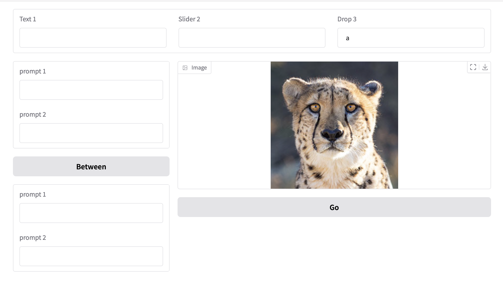
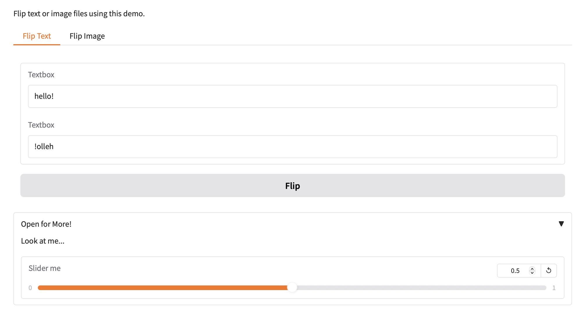
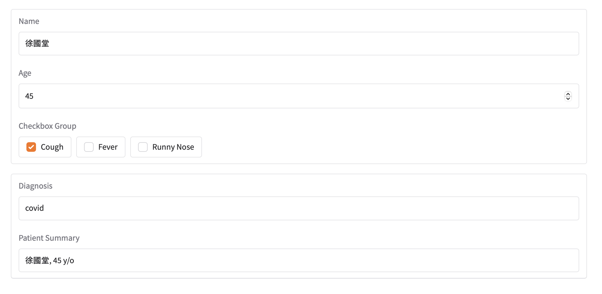

# 📐 版面配置控制 (Controlling Layout)

Gradio 預設會將組件垂直堆疊渲染。然而，使用 `gr.Blocks` 您可以靈活規劃極為精緻、符合現代 Web 設計的 UI 版面。本章介紹如何控制元件的排列、寬高與動態顯示。

---

## 橫向排列：列 (Rows)

使用 `with gr.Row():` 可以將包裝在內的元件由左至右橫向排列。

```python
with gr.Blocks() as demo:
    with gr.Row():
        btn1 = gr.Button("按鈕 1")
        btn2 = gr.Button("按鈕 2")
```

### 對齊高度 (`equal_height`)
若列內元件的高度不一，您可以設定 `equal_height=True` 強制拉伸為相同高度（這在文字框旁放置按鈕時特別實用）：

```python
with gr.Blocks() as demo:
    # equal_height 確保文字框與按鈕在高度上完美對齊
    with gr.Row(equal_height=True):
        textbox = gr.Textbox(label="請輸入內容")
        btn = gr.Button("提交")
```

---

## 垂直排列與比例控制：欄 (Columns)

使用 `with gr.Column():` 可以將組件垂直排列。這是 Blocks 內預設的排版方式，但它與 `gr.Row` 搭配時能發揮極大威力。

### 彈性寬度比例 (`scale`) 與最小寬度 (`min_width`)
- **`scale`**：為整數，代表該欄（或該元件）在 Row 內分配寬度的相對權重。
  - `scale=0`：不會擴充，保持該組件本身的最小寬度。
  - `scale=1`：分配基礎比例。
  - `scale=2`：分配兩倍比例。
- **`min_width`**：設定組件的最小像素寬度。若瀏覽器視窗變窄，使得分配寬度小於 `min_width`，版面將會自動換行以適應響應式設計（RWD）。

```python
with gr.Blocks() as demo:
    with gr.Row():
        # 按鈕 0 保持最小寬度，不參與比例分配
        btn0 = gr.Button("固寬按鈕", scale=0)
        # 按鈕 1 分配 1 份寬度
        btn1 = gr.Button("中寬度按鈕", scale=1)
        # 按鈕 2 分配 2 份寬度
        btn2 = gr.Button("寬按鈕", scale=2)
```

---

## 網格與巢狀排版 (Nested Layouts)

藉由將 `gr.Row` 與 `gr.Column` 互相嵌套，您可以建立功能強大、類似專業 Dashboard 的網格版面。

```python
import gradio as gr

with gr.Blocks() as demo:
    # 第一列：水平均分三個輸入元件
    with gr.Row():
        text1 = gr.Textbox(label="文字輸入 1")
        slider2 = gr.Slider(0, 100, label="滑桿控制 2")
        drop3 = gr.Dropdown(choices=["A", "B", "C"], label="下拉選單 3")
    
    # 第二列：左右分割 (左 1: 右 2)
    with gr.Row():
        # 左側欄位
        with gr.Column(scale=1, min_width=300):
            prompt1 = gr.Textbox(label="提示詞 1")
            prompt2 = gr.Textbox(label="提示詞 2")
            inbtw = gr.Button("中間按鈕")
            prompt3 = gr.Textbox(label="提示詞 3")
        
        # 右側欄位
        with gr.Column(scale=2, min_width=300):
            # 引入本地檔案 "cheetah.jpg" 展示影像
            img1 = gr.Image("cheetah.jpg", label="展示影像")
            btn = gr.Button("開始執行 (Go)")

demo.launch()
```

*執行後的網頁介面如下：*



---

## 📏 填滿瀏覽器與尺寸控制

### 自適應填滿高度 (`fill_height`)
若您希望建立一個填滿整個瀏覽器視窗高度的應用（例如大型聊天室），可以將 `gr.Blocks(fill_height=True)` 啟用，並將主要元件的 `scale` 設為 `1`：

```python
import gradio as gr

# fill_height=True 會讓應用程式撐滿整個網頁高度
with gr.Blocks(fill_height=True) as demo:
    chatbot = gr.Chatbot(scale=1, label="AI 聊天助手")
    textbox = gr.Textbox(scale=0, placeholder="在此輸入您的問題...")
    
demo.launch()
```

### 指定寬高規格 (Dimensions)
您可以對許多組件（如 Image、Markdown、ImageEditor 等）直接指定具體的寬高，支援 CSS 單位（如 `"300px"`、`"50vw"`）：

```python
import gradio as gr

with gr.Blocks() as demo:
    # 寬度佔瀏覽器寬度的一半 (50vw)
    im = gr.ImageEditor(width="50vw", label="影像編輯器")

demo.launch()
```

---

## 🗂️ 分頁與摺疊面板 (Tabs & Accordions)

### 分頁元件 (`gr.Tab`)
分頁元件非常適合用來分類不同的子功能，讓介面乾淨整潔。

### 摺疊面板 (`gr.Accordion`)
摺疊面板能隱藏不常用的高級參數，避免 UI 過於雜亂。

```python
import numpy as np
import gradio as gr

def flip_text(x):
    return x[::-1] if x else ""

def flip_image(x):
    return np.fliplr(x) if x is not None else None

with gr.Blocks() as demo:
    gr.Markdown("## 🔄 文字與影像反轉處理工具")
    
    # 建立兩個分頁
    with gr.Tab("📝 文本反轉"):
        text_input = gr.Textbox(label="輸入文字")
        text_output = gr.Textbox(label="反轉結果")
        text_button = gr.Button("執行文字反轉")
    
    with gr.Tab("🖼️ 影像反轉"):
        with gr.Row():
            image_input = gr.Image(label="原始影像")
            image_output = gr.Image(label="反轉結果")
        image_button = gr.Button("執行影像反轉")

    # 摺疊面板，預設關閉 (open=False)
    with gr.Accordion("⚙️ 進階控制參數", open=False):
        gr.Markdown("可在此處微調進階處理選項：")
        temp_slider = gr.Slider(
            0, 1, 
            value=0.1,
            step=0.1,
            interactive=True,
            label="強度閥值"
        )

    text_button.click(flip_text, inputs=text_input, outputs=text_output)
    image_button.click(flip_image, inputs=image_input, outputs=image_output)

demo.launch()
```



---

## 👁️ 動態顯示控制 (Visibility)

您可以動態將某個 `Column`、`Row` 或組件設定為 `visible=False` 進行隱藏，待特定事件完成後再透過函數回傳 `gr.Column(visible=True)` 來顯示它。

```python
import gradio as gr

with gr.Blocks() as demo:
    name_box = gr.Textbox(label="病人姓名")
    age_box = gr.Number(label="年齡", minimum=0, maximum=100, value=25)
    symptoms_box = gr.CheckboxGroup(["咳嗽 (Cough)", "發燒 (Fever)", "流鼻水 (Runny Nose)"], label="症狀描述")
    submit_btn = gr.Button("送出診斷")

    # 預設隱藏此輸出欄位 (visible=False)
    with gr.Column(visible=False) as output_col:
        diagnosis_box = gr.Textbox(label="診斷結果")
        patient_summary_box = gr.Textbox(label="病人摘要")
    
    def submit(name, age, symptoms):
        diagnosis = '疑似新冠 (COVID-19)' if '咳嗽 (Cough)' in symptoms else '一般流感 (Flu)'
        return {
            submit_btn: gr.Button(visible=False), # 隱藏送出按鈕
            diagnosis_box: diagnosis,
            patient_summary_box: f"患者：{name}，年齡：{age} 歲",
            output_col: gr.Column(visible=True) # 顯示輸出欄位
        }
    
    submit_btn.click(
        submit,
        inputs=[name_box, age_box, symptoms_box],
        outputs=[submit_btn, diagnosis_box, patient_summary_box, output_col]
    )

demo.launch()
```




