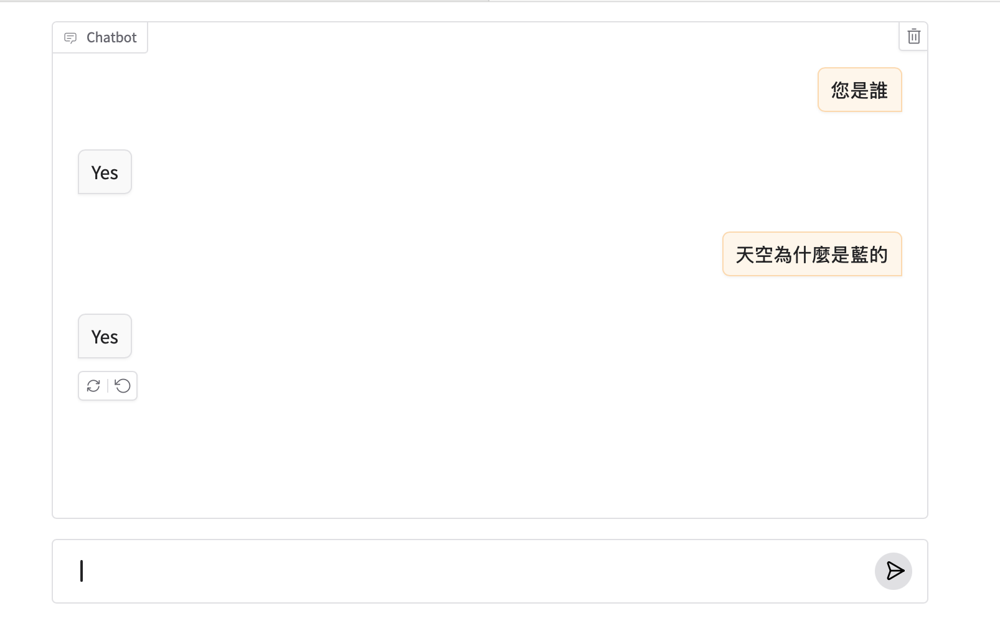
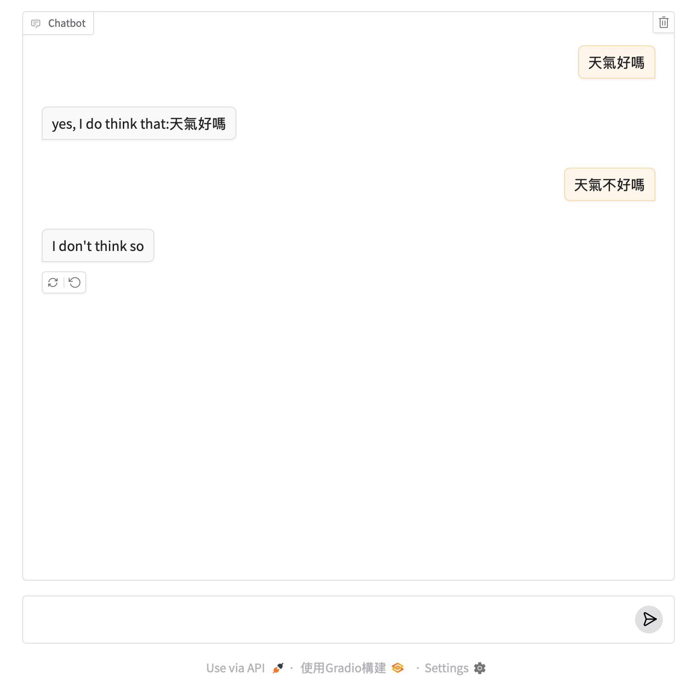
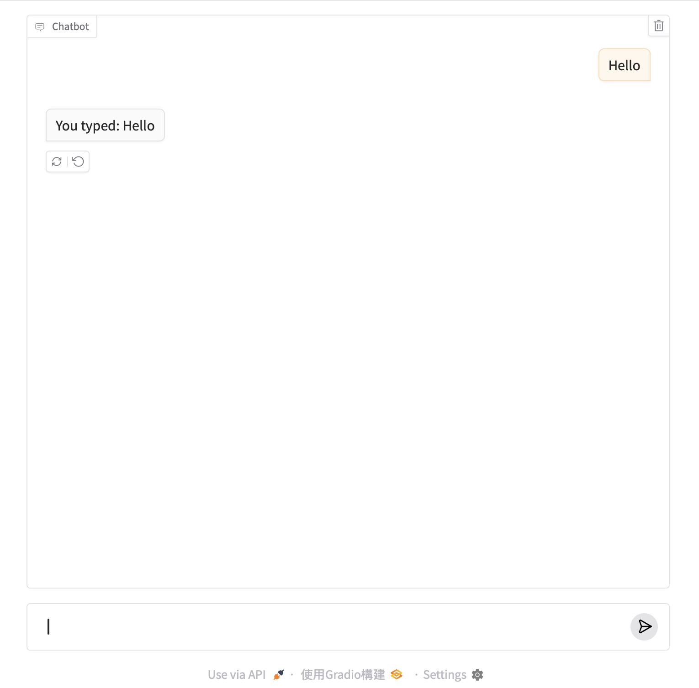
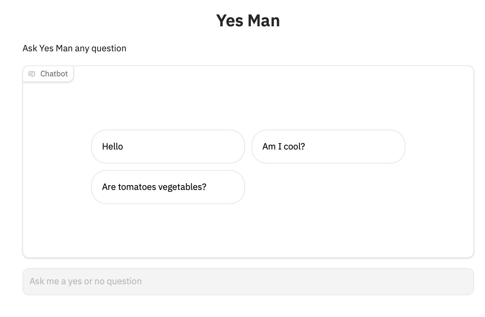

## 如何建立一個Gradio Chatbot

## 整合olloma

```python
import gradio as gr

gr.load_chat("http://localhost:11434/v1/", model="llama3.2", token="ollama").launch()
```


## 定義一個chat 函式

使用gr.ChatInterface()建立一個chatbot應用程式, 第1件事必需定義自已的chat 函式,在最簡單的範例中,你的chat 函式必需接受2個引數:message和history,可以任何的引數名稱,但要依順序

- message: 型別為str,是使用者填寫的資料
- history: 是一個openai樣式的dictionary,包含role和content的key,儲存先前的對話記錄。

**history的格式如下**

```python
[
    {"role": "user", "content": "What is the capital of France?"},
    {"role": "assistant", "content": "Paris"}
]
```

如果下一個message如下:

```
"And what is its largest city?"
```

這是chat 函式必需要傳出字串

- return 值 - 這個值是依據history和message傳出的回答,如這個案例

```
Paris is also the largest city.
```

**範例,亂數傳出Yes或No

```
import gradio as gr
import random

def random_message(message, history):
    return random.choice(['Yes','No'])

gr.ChatInterface(
    fn = random_message,
    type = "messages"
).launch()
```

- type: 一定都要設為`messages`



**範例,輪流傳出agreeing and disagreeing**

```
import gradio as gr

def alternatingly_agree(message, history):
    if len([h for h in history if h['role']=='assistant']) % 2 == 0:
        return f"yes, I do think that:{message}"
    else:
        return "I don't think so"

gr.ChatInterface(
    fn = alternatingly_agree,
    type = "messages"
).launch()
```



## 串流的chatbots(Streaming chatbots)
在chat函式內傳出使用yield,每次傳出的str,會取代先前在chatbot畫面上原來的值

```
import time
import gradio as gr

def slow_echo(message, history):
    for i in range(len(message)):
        time. sleep(0.3)
        yield "You typed: " + message[:i+1]

demo = gr.ChatInterface(
    fn = slow_echo,
    type = "messages"
    )

demo.launch()
```



## 自訂Chat外觀-Customizing the Chat UI

- 增加title,description引數
- 增加theme,使用theme和css引數
- 增加examples,讓使用者可以容易的測試
- 改變height, placehoder或textbox(最大數量的字數或增加placeholder)


### 增加examples
- 使用exmaples->使用list of str
- 如果有包涵圖片->使用list of dict,dict的格式如下:
	- {'text': "What's in this image?", "files":["cheetah.jpg"]}


**自定chatbot 或 textbox組件

```python
import gradio as gr

def yes_man(message, history):
    if message.endswith("?"):
        return "Yes"
    else:
        return "Ask me anything!"

demo = gr.ChatInterface(
    fn = yes_man,
    type= "messages",
    chatbot = gr.Chatbot(height=300),
    textbox = gr.Textbox(placeholder="Ask me a yes or no question", container=False, scale=7),
    title = "Yes Man",
    description = "Ask Yes Man any question",
    theme = "ocean",
    examples = ["Hello", "Am I cool?", "Are tomatoes vegetables?"]
)

demo.launch()
```



**chatbot的placeholder引數接受Markdown語法或html語法**

```python
gr.ChatInterface(
    yes_man,
    type="messages",
    chatbot=gr.Chatbot(placeholder="<strong>Your Personal Yes-Man</strong><br>Ask Me Anything"),
```


