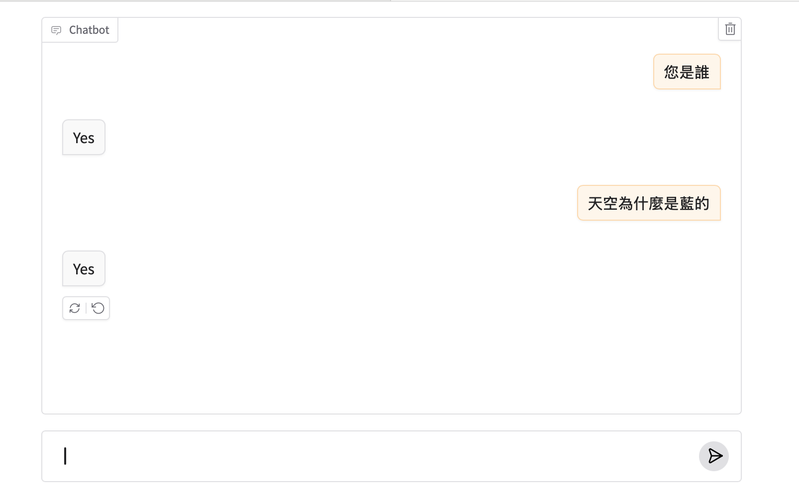
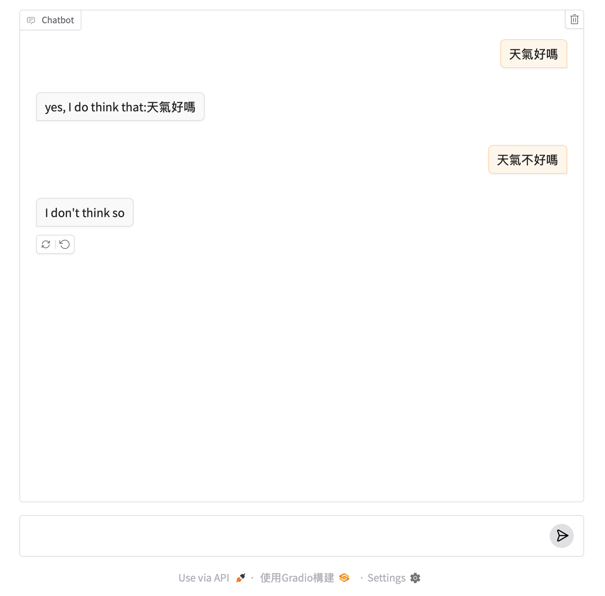
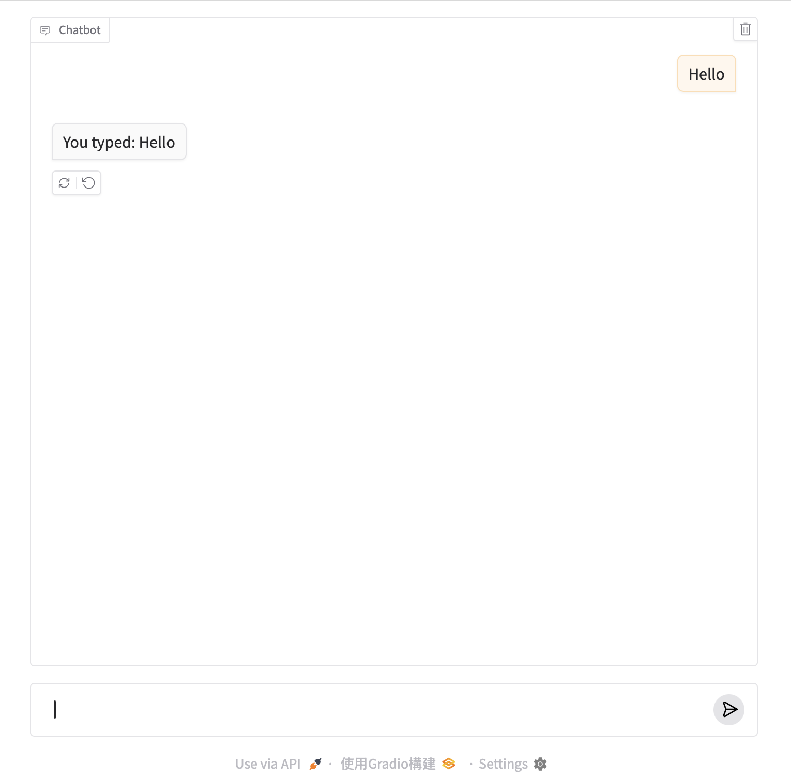
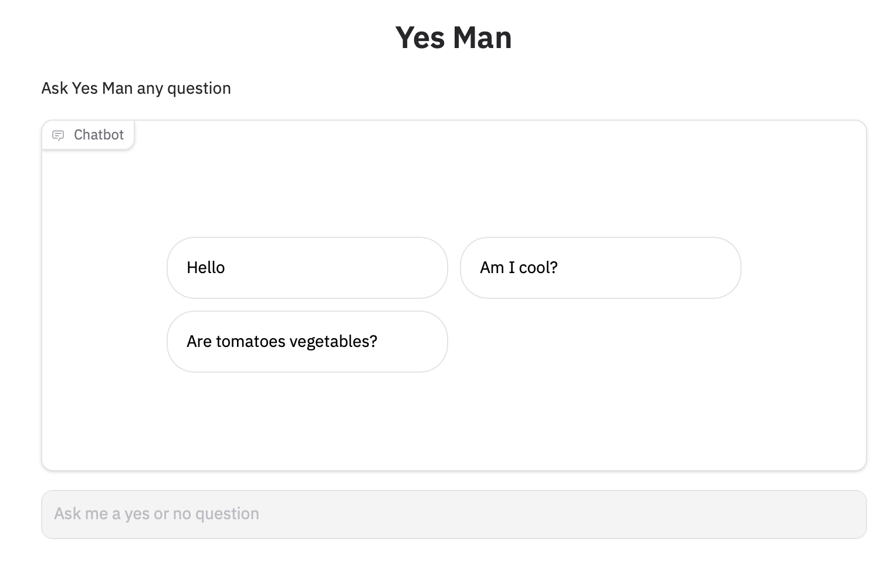

# 💬 快速構建聊天機器人 (Chatbots)

Gradio 提供了高階組件 **`gr.ChatInterface`**，專為對話式應用程式設計。您可以利用它在幾行程式碼內，快速包裝大語言模型 (LLM)，建立一個具備對話紀錄、清除、重試等功能的完整聊天機器人。

---

## 🔌 1. 整合 Ollama 本地模型

如果您在本地執行 Ollama，可以直接使用 `gr.load_chat` 一行程式碼載入並啟動與 LLM 的對話介面：

```python
import gradio as gr

# 載入本地運行的 Llama 3.2 模型並啟動對話網頁
gr.load_chat("http://localhost:11434/v1/", model="llama3.2", token="ollama").launch()
```

---

## 🛠️ 2. 自訂對話處理函數 (Chat Function)

當您要結合客製化模型或自訂 API 時，您需要定義一個問答處理函數。

在最基礎的架構下，您的問答函數必須依序接受兩個參數：
1.  **`message`** (`str`)：使用者當前輸入的文字。
2.  **`history`** (`list[dict]`)：包含先前所有對話紀錄的列表。

### 📝 對話歷史紀錄的格式

> [!IMPORTANT]
> **📢 Gradio 5 版本歷史紀錄格式重大變更：**
> *   **新版格式 (推薦)**：在 Gradio 5 中，預設且推薦的格式為 **OpenAI 樣式的字典列表 (`type="messages"`)**，其結構如以下範例所示。這能完美與各大 LLM API（如 OpenAI, Anthropic）對接。
> *   **舊版格式 (Tuples)**：若您的程式碼使用的是舊版的二元列表（例如 `[[user_msg, bot_msg], ...]`），您必須在 `gr.Chatbot` 或 `gr.ChatInterface` 的參數中顯式加上 **`type="tuples"`**，否則會發生型態不相容的錯誤。
> 
> 以下為 Gradio 5 預設的 `type="messages"` 結構：
> 
```python
[
    {"role": "user", "content": "法國的首都是哪裡？"},
    {"role": "assistant", "content": "巴黎。"}
]
```

### 範例 A：簡單的隨機回覆機器人 (Yes/No Bot)

被執行的函數必須回傳一個 `str` 作為機器人的回覆內容：

```python
import gradio as gr
import random

def random_message(message, history):
    # 隨機回覆是的或不對
    return random.choice(['是的 (Yes)', '不對 (No)'])

gr.ChatInterface(
    fn=random_message,
    type="messages" # 設定為 messages 模式以使用 OpenAI 樣式的 history 格式
).launch()
```



> [!WARNING]
> 請務必指定 `type="messages"`，以確保傳入函數的 `history` 格式為最新的 `dict` 列表。

---

### 範例 B：根據歷史紀錄進行交替回覆的機器人

```python
import gradio as gr

def alternatingly_agree(message, history):
    # 計算歷史對話中機器人回答了幾次，藉此決定這次要同意還是反對
    assistant_messages = [h for h in history if h['role'] == 'assistant']
    if len(assistant_messages) % 2 == 0:
        return f"沒錯，我也這麼認為：{message}"
    else:
        return "我不這麼認為。"

gr.ChatInterface(
    fn=alternatingly_agree,
    type="messages"
).launch()
```



---

## 🌊 3. 串流聊天機器人 (Streaming Chatbots)

若您希望機器人能有類似 ChatGPT 的「打字機」逐字輸出效果，只需在對話處理函數中使用 Python 的 Generator (`yield`) 即可。每次 `yield` 傳出的字串都會即時更新並覆蓋前一次的對話內容：

```python
import time
import gradio as gr

def slow_echo(message, history):
    # 逐字累加輸出使用者輸入的文字
    for i in range(len(message)):
        time.sleep(0.1)
        yield "您輸入了：" + message[:i+1]

demo = gr.ChatInterface(
    fn=slow_echo,
    type="messages"
)

demo.launch()
```



---

## 🎨 4. 自訂聊天介面外觀 (Customizing Chat UI)

`gr.ChatInterface` 提供了豐富的自訂選項，讓您可以微調主題、標題、輸入框行為或添加測試範例：

*   **`title`** 與 **`description`**：在聊天室上方新增標題與副標題。
*   **`theme`**：套用 Gradio 預設主題（如 `"ocean"`, `"soft"`, `"monochrome"`）。
*   **`examples`**：提供預設問題，使用者點選即可發送。
*   **`chatbot`** 與 **`textbox`**：傳入自訂的 `gr.Chatbot` 與 `gr.Textbox` 實例，用以調整元件高度、placeholder、或比例。

### 綜合範例：是是先生 (Yes Man) 聊天機器人

```python
import gradio as gr

def yes_man(message, history):
    if message.endswith("?"):
        return "是的！"
    else:
        return "請儘管問我任何問題！"

demo = gr.ChatInterface(
    fn=yes_man,
    type="messages",
    # 傳入客製化的 Chatbot 與 Textbox 元件以微調外觀
    chatbot=gr.Chatbot(height=350, placeholder="<strong>🤖 歡迎來到是是先生的對話室</strong><br>不論您問什麼是非題，我都會舉雙手贊成！"),
    textbox=gr.Textbox(placeholder="請輸入一個是非題（以問號 ? 結尾）...", container=False, scale=7),
    title="👍 是是先生 (Yes Man)",
    description="問『是是先生』任何問題，他都會欣然同意！",
    theme="ocean",
    examples=["你好", "我很酷嗎？", "番茄是蔬菜嗎？"]
)

demo.launch()
```




