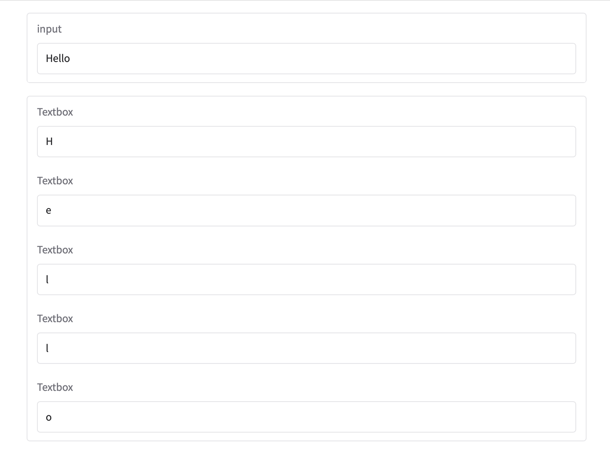
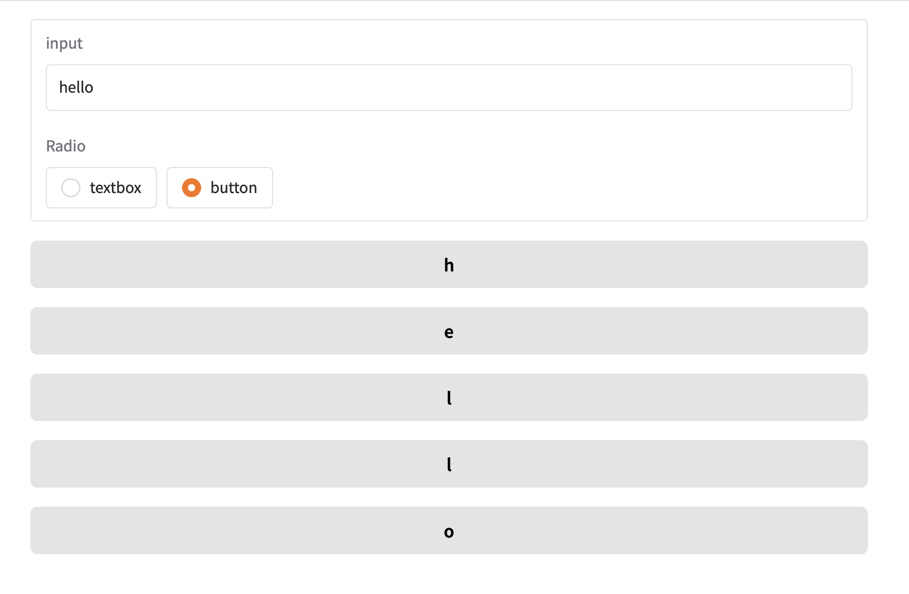
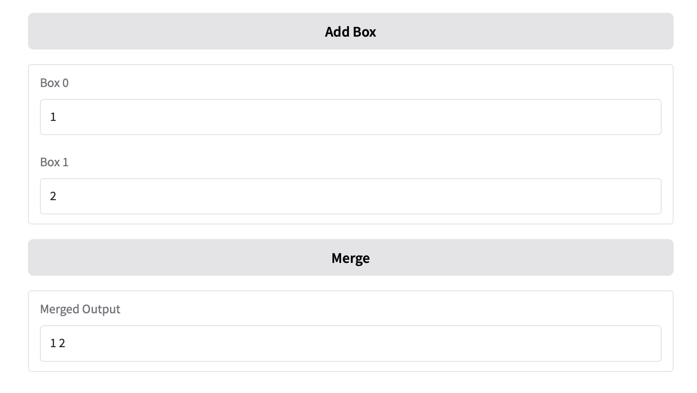
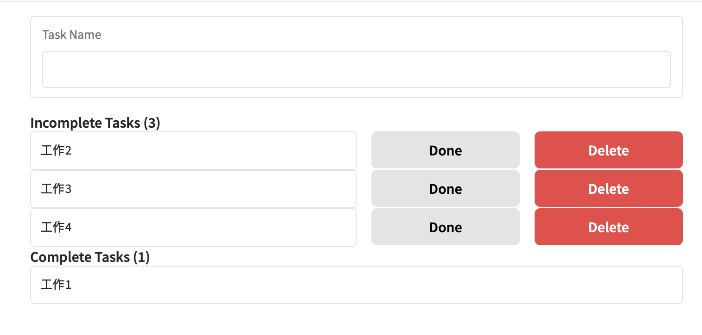

## 使用Rrender decorator建立動態App

至目前為止在Blocks內定義的組件和事件監聽器都是固定的.一但啟動無法新增和移除。

- @gr.render decodator可以動態新增移除介面

```python
#Dynamic Apps with the Render Decorator

import gradio as gr

with gr.Blocks() as demo:
    input_text = gr.Textbox(label='input')

    @gr.render(inputs=input_text)
    def show_split(text):
        if len(text) == 0:
            gr.Markdown("## No Input Provided")
        else:
            for letter in text:
                gr.Textbox(letter)

demo.launch()

```



```python
import gradio as gr

with gr.Blocks() as demo:
    input_text = gr.Textbox(label="input")
    mode = gr.Radio(["textbox", "button"], value="textbox")

    @gr.render(inputs=[input_text, mode],triggers=[input_text.submit])
    def show_split(text, mode):
        if len(text) == 0:
            gr.Markdown("## No Input Provided")
        else:
            for letter in text:
                if mode == "textbox":
                    gr.Text(letter)
                else:
                    gr.Button(letter)

demo.launch()
```



### 動態的事件監聽

```python
import gradio as gr

with gr.Blocks() as demo:
    text_count = gr.State(1)
    add_btn = gr.Button("Add Box")
    add_btn.click(
        fn = lambda x: x+1,
        inputs = text_count,
        outputs = text_count
    )

    @gr.render(inputs=text_count)
    def render_count(count):
        print(count)
        boxes = []
        for i in range(count):
            box = gr.Textbox(key=i, label=f"Box {i}")
            boxes.append(box)

        def merge(*args):
            return " ".join(args)
        
        merge_btn.click(merge, boxes, output)
    
    merge_btn = gr.Button("Merge")
    output = gr.Textbox(label="Merged Output")

demo.launch()

```



### 動態事件監聽

```python
import gradio as gr

with gr.Blocks() as demo:
    text_count = gr.State(1)
    add_btn = gr.Button("Add Box")
    add_btn.click(
        fn = lambda x: x+1,
        inputs = text_count,
        outputs = text_count
    )

    @gr.render(inputs=text_count)
    def render_count(count):
        print(count)
        boxes = []
        for i in range(count):
            box = gr.Textbox(key=i, label=f"Box {i}")
            boxes.append(box)

        def merge(*args):
            return " ".join(args)
        
        merge_btn.click(merge, boxes, output)
    
    merge_btn = gr.Button("Merge")
    output = gr.Textbox(label="Merged Output")

demo.launch()

```


### 動態組件和動態事件監聽放在一起

```python
#Putting it Together

import gradio as gr

with gr.Blocks() as demo:
    tasks = gr.State([])
    new_task = gr.Textbox(label="Task Name", autofocus=True)

    def add_task(tasks, new_task_name):
        return tasks + [{"name":new_task_name, "complete": False}], ""
    
    new_task.submit(
        fn = add_task,
        inputs = [tasks, new_task],
        outputs = [tasks, new_task]
        )
    
    @gr.render(inputs=tasks)
    def render_todos(task_list):
        complete = [task for task in task_list if task["complete"]]
        incomplete = [task for task in task_list if not task["complete"]]
        gr.Markdown(f'### Incomplete Tasks ({len(incomplete)})')
        for task in incomplete:
            with gr.Row():
                gr.Textbox(task['name'], show_label=False, container=False)
                done_btn = gr.Button("Done", scale=0)
                def mark_done(task=task):
                    print(task)
                    task["complete"] = True
                    return task_list
                done_btn.click(mark_done, None, tasks)

                delete_btn = gr.Button("Delete", scale=0, variant="stop")
                def delete(task=task):
                    task_list.remove(task)
                    return task_list
                
                delete_btn.click(delete, None, tasks)
        
        gr.Markdown(f"### Complete Tasks ({len(complete)})")
        for task in complete:
            gr.Textbox(task['name'], show_label=False, container=False)

demo.launch()
```




