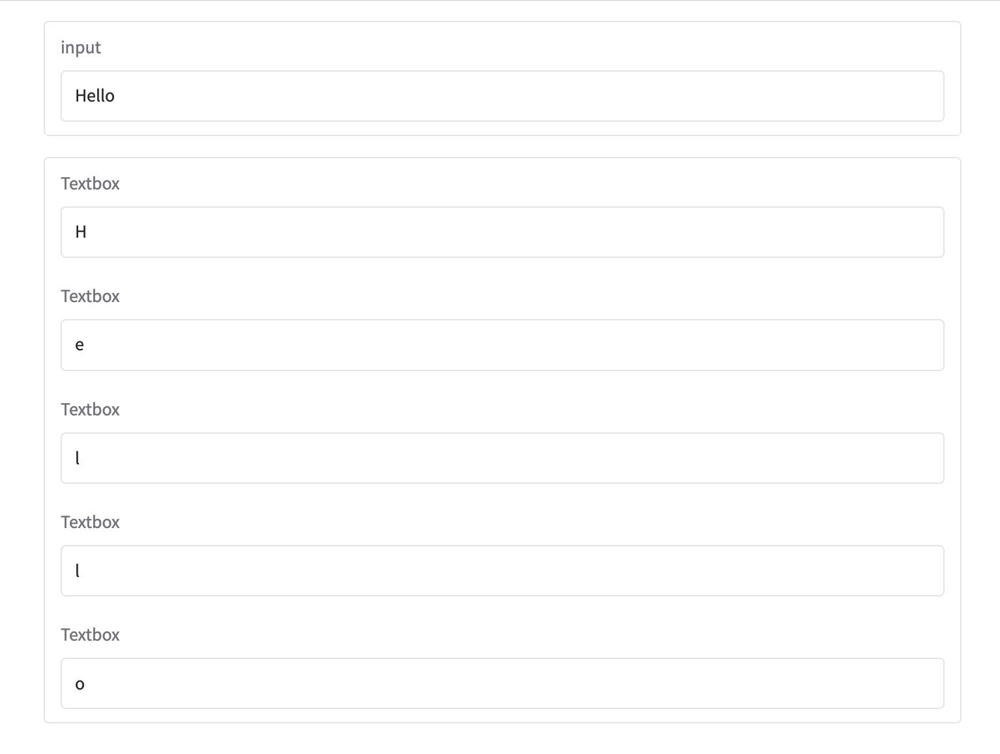
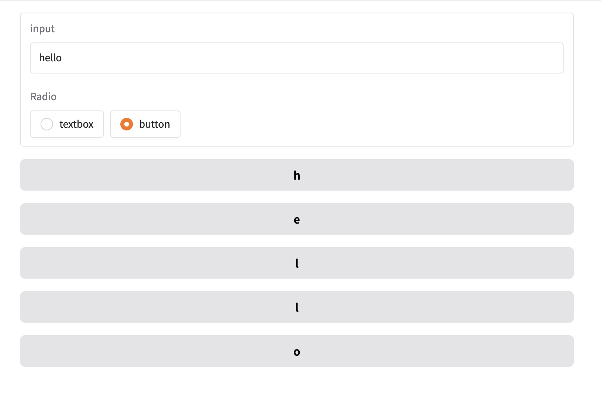
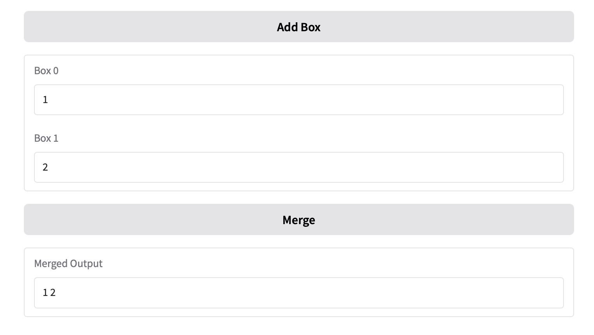
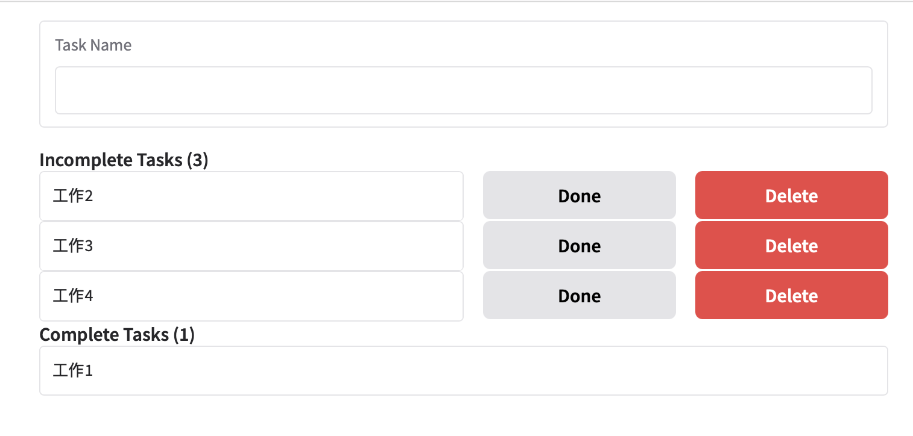

# ⚡ 使用 gr.render 建立動態組件與事件

在 Gradio 的傳統 Blocks 結構中，所有的 UI 組件（如 Textbox、Button）以及事件監聽器都是在啟動時固定定義好的，一旦啟動後便無法動態新增或移除。

為了讓介面能根據使用者的即時操作動態改變，Gradio 提供了 **`@gr.render` 裝飾器**，讓開發者能夠在執行期（Runtime）動態地渲染組件並綁定事件。

---

## 🟢 1. 基本動態渲染 (gr.render)

`@gr.render` 裝飾器會監聽指定的輸入組件。每當該組件的值發生改變時，被裝飾的函數就會**重新執行**，並動態重新繪製內建的 UI 元件。

### 範例：將輸入文字拆解為多個單獨的文字框

```python
import gradio as gr

with gr.Blocks() as demo:
    input_text = gr.Textbox(label="請輸入文字")

    # 當 input_text 的值改變時，自動觸發 show_split 重新渲染
    @gr.render(inputs=input_text)
    def show_split(text):
        if len(text) == 0:
            gr.Markdown("### ⚠️ 尚無輸入內容")
        else:
            # 動態為每一個字元建立一個 Textbox 顯示
            for letter in text:
                gr.Textbox(letter, show_label=False)

demo.launch()
```



---

## 🔵 2. 多組件動態控制與觸發限制

您可以讓 `@gr.render` 監聽多個組件，並透過 `triggers` 限制重新渲染的頻率（例如：只在使用者按下 Enter 時才重新渲染，而不是打字時即時更新）：

```python
import gradio as gr

with gr.Blocks() as demo:
    input_text = gr.Textbox(label="請輸入文字")
    mode = gr.Radio(["文字框 (Textbox)", "按鈕 (Button)"], value="文字框 (Textbox)", label="選擇渲染的組件類型")

    # 只有在 input_text 觸發 submit (按下 Enter) 時，才會觸發重新渲染
    @gr.render(inputs=[input_text, mode], triggers=[input_text.submit])
    def show_split(text, mode):
        if len(text) == 0:
            gr.Markdown("### ⚠️ 尚無輸入內容")
        else:
            for letter in text:
                if mode == "文字框 (Textbox)":
                    gr.Textbox(letter, show_label=False)
                else:
                    gr.Button(letter)

demo.launch()
```



---

## 🟡 3. 動態事件監聽

若您在 `@gr.render` 函數內部建立元件，亦可在函數內部**即時為這些新元件綁定事件**。這允許我們動態改變資料流管道。

### 範例：動態增減輸入框並合併內容

```python
import gradio as gr

with gr.Blocks() as demo:
    # 使用 Session State 紀錄輸入框數量
    text_count = gr.State(1)
    add_btn = gr.Button("➕ 新增文字框")
    
    # 每次點擊按鈕，將狀態計數加 1
    add_btn.click(
        fn=lambda x: x + 1,
        inputs=text_count,
        outputs=text_count
    )

    # 監聽 text_count，數量變更時重新繪製輸入框列表
    @gr.render(inputs=text_count)
    def render_count(count):
        boxes = []
        for i in range(count):
            box = gr.Textbox(key=i, label=f"輸入框 {i}")
            boxes.append(box)

        # 在 render 內部定義合併邏輯並綁定外部按鈕
        def merge(*args):
            return " ".join(args)
        
        merge_btn.click(merge, inputs=boxes, outputs=output)
    
    merge_btn = gr.Button("🔗 合併文字")
    output = gr.Textbox(label="合併後的輸出結果")

demo.launch()
```



---

## 🟣 4. 綜合應用：動態待辦清單 (To-Do List)

結合 `gr.State` 與 `@gr.render`，我們能輕鬆打造出像 React 一樣擁有狀態管理與動態組件的 Web App：

```python
import gradio as gr

with gr.Blocks() as demo:
    tasks = gr.State([]) # 存放待辦清單：[{"name": "...", "complete": False}]
    new_task = gr.Textbox(label="🆕 新增待辦事項", autofocus=True, placeholder="在此輸入任務並按下 Enter 送出...")

    def add_task(tasks, new_task_name):
        if not new_task_name.strip():
            return tasks, ""
        return tasks + [{"name": new_task_name, "complete": False}], ""
    
    new_task.submit(
        fn=add_task,
        inputs=[tasks, new_task],
        outputs=[tasks, new_task]
    )
    
    # 每當 tasks 清單更新時，重新渲染清單 UI
    @gr.render(inputs=tasks)
    def render_todos(task_list):
        complete = [task for task in task_list if task["complete"]]
        incomplete = [task for task in task_list if not task["complete"]]
        
        gr.Markdown(f'### 📝 未完成事項 ({len(incomplete)})')
        for task in incomplete:
            with gr.Row():
                gr.Textbox(task['name'], show_label=False, container=False, scale=1)
                
                done_btn = gr.Button("完成", scale=0)
                # 使用預設參數閉包綁定特定的 task
                def mark_done(task=task):
                    task["complete"] = True
                    return task_list
                done_btn.click(mark_done, None, tasks)

                delete_btn = gr.Button("刪除", scale=0, variant="stop")
                def delete(task=task):
                    task_list.remove(task)
                    return task_list
                delete_btn.click(delete, None, tasks)
        
        gr.Markdown(f"### ✅ 已完成事項 ({len(complete)})")
        for task in complete:
            gr.Textbox(task['name'], show_label=False, container=False)

demo.launch()
```




