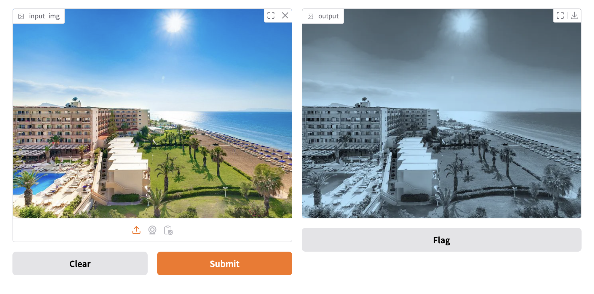

## 4種版面版型

1. 標準(輸入-輸出)-> 例如影像分類,question-to-answer, speech-to-text
2. 僅有輸出(輸出) -> 隨機產生圖像
3. 僅有輸入(輸入) -> 輸入資料,直接儲存至外部資料庫
4. 輸入輸出有同一個介面 -> 自動完成

## 標準版型

```python
import numpy as np
import gradio as gr

def sepia(input_img):
    sepia_filter = np.array([[0.272, 0.534, 0.131],
                             [0.349, 0.686, 0.168],
                             [0.393, 0.769, 0.189]])
    sepia_img = input_img.dot(sepia_filter.T)
    sepia_img /= sepia_img.max()                          
    return sepia_img

demo = gr.Interface(
    fn=sepia, 
    inputs="image", 
    outputs="image")

demo.launch()
```



## 僅有輸出版面


