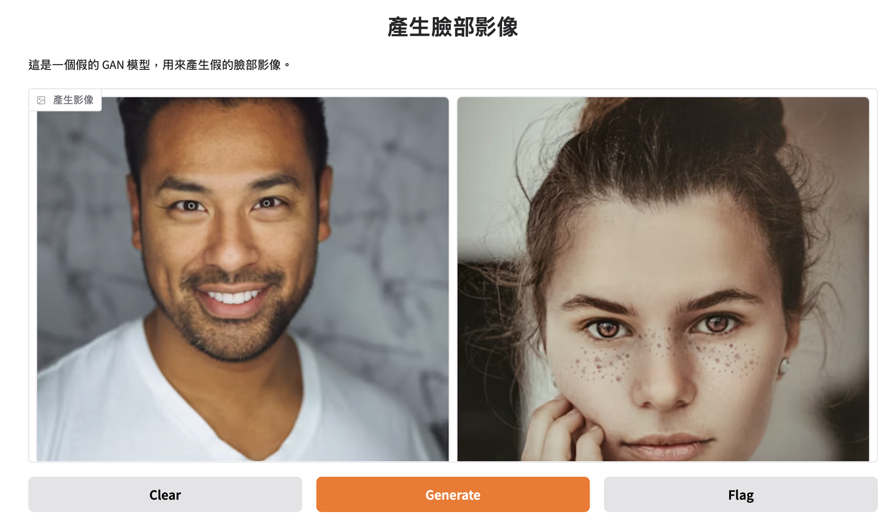
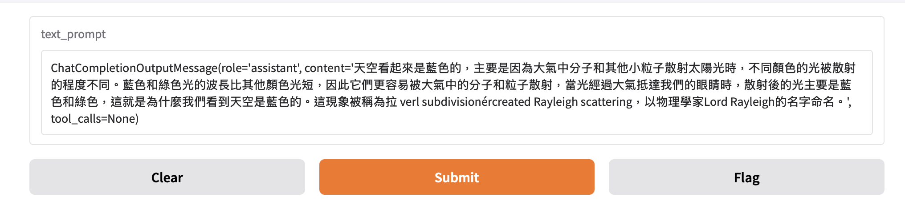

## 4種版面版型

1. 標準(輸入-輸出)-> 例如影像分類,question-to-answer, speech-to-text
2. 僅有輸出(輸出) -> 隨機產生圖像
3. 僅有輸入(輸入) -> 輸入資料,直接儲存至外部資料庫
4. 輸入輸出有同一個介面 -> 自動完成

## 標準版型

```python
import numpy as np
import gradio as gr

def sepia(input_img):
    sepia_filter = np.array([[0.272, 0.534, 0.131],
                             [0.349, 0.686, 0.168],
                             [0.393, 0.769, 0.189]])
    sepia_img = input_img.dot(sepia_filter.T)
    sepia_img /= sepia_img.max()                          
    return sepia_img

demo = gr.Interface(
    fn=sepia, 
    inputs="image", 
    outputs="image")

demo.launch()
```


## 僅有輸出版面

```python
import time
import gradio as gr

def fake_gan():
    time.sleep(1)
    images =[
        "https://images.unsplash.com/photo-1507003211169-0a1dd7228f2d?ixlib=rb-1.2.1&ixid=MnwxMjA3fDB8MHxwaG90by1wYWdlfHx8fGVufDB8fHx8&auto=format&fit=crop&w=387&q=80",
        "https://images.unsplash.com/photo-1554151228-14d9def656e4?ixlib=rb-1.2.1&ixid=MnwxMjA3fDB8MHxwaG90by1wYWdlfHx8fGVufDB8fHx8&auto=format&fit=crop&w=386&q=80",
        "https://images.unsplash.com/photo-1542909168-82c3e7fdca5c?ixlib=rb-1.2.1&ixid=MnwxMjA3fDB8MHxzZWFyY2h8MXx8aHVtYW4lMjBmYWNlfGVufDB8fDB8fA%3D%3D&w=1000&q=80",
    ]
    return images

demo = gr.Interface(
    fn = fake_gan,
    inputs = None,
    outputs = gr.Gallery(label="產生影像", columns=2),
    title = "產生臉部影像",
    description="這是一個假的 GAN 模型，用來產生假的臉部影像。"
)

demo.launch()
```



## 僅有輸入版面

```python
import random
import string
import gradio as gr

def save_image_random_name(image):
    random_name = ''.join(random.choices(string.ascii_letters, k=10)) + '.png'
    image.save(random_name)
    print(f"儲存:{random_name}影像")

demo = gr.Interface(
    fn = save_image_random_name,
    inputs = gr.Image(type='pil'), 
    outputs = None)

demo.launch()
```

## 輸入輸出有同一個介面

```python
from huggingface_hub import InferenceClient
import gradio as gr


client = InferenceClient(api_key="xxxxxxxxxxxxxxxxxxxxxxxx")

def generate_text(text_prompt):
    messages = [
        {
            "role": "user",
            "content": text_prompt
        }
    ]

    completion = client.chat.completions.create(
        model="mistralai/Mistral-Nemo-Instruct-2407", 
        messages=messages, 
        max_tokens=500,
    )

    return completion.choices[0].message
    
textbox = gr.Textbox()

demo = gr.Interface(
    fn = generate_text,
    inputs = textbox,
    outputs = textbox)
    
demo.launch()

```




