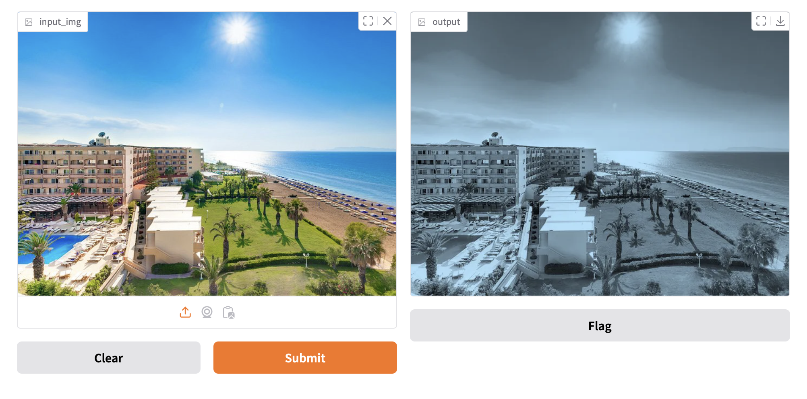
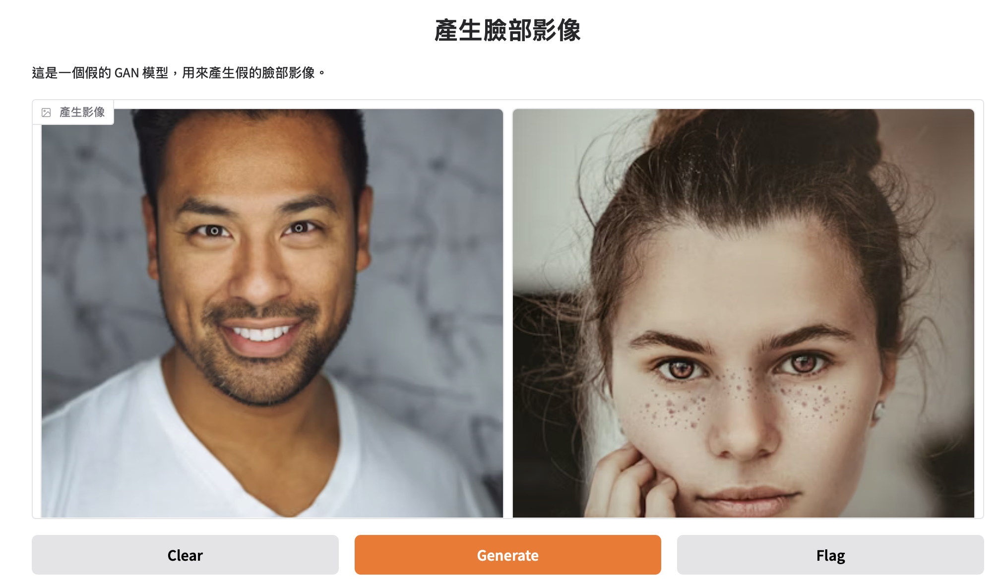
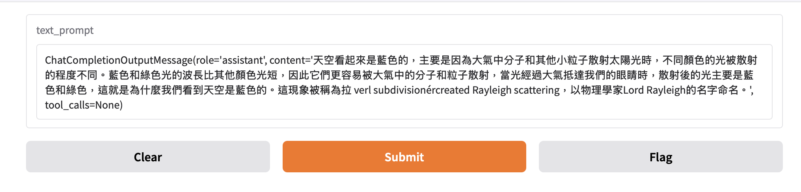

# 📐 四種基本版面配置型態

Gradio 的 `gr.Interface` 類別內建支援四種不同結構的 UI 版面配置，能完美適應各種不同的機器學習任務需求：

| 版面類型 | 輸入元件 | 輸出元件 | 常見應用場景 |
| :--- | :--- | :--- | :--- |
| **1. 標準版型** | 有 | 有 | 影像分類、問答系統 (Q&A)、語音轉文字等 |
| **2. 僅輸出型** | 無 (`None`) | 有 | 隨機圖像產生器、隨機文本生成 (GAN/Diffusion 展示) |
| **3. 僅輸入型** | 有 | 無 (`None`) | 資料收集表單、直接儲存輸入資料至外部資料庫 |
| **4. 同介面輸入輸出** | 有 (共享) | 有 (共享) | 文本自動補齊 (Autocomplete)、即時對話修改 |

---

## 🟢 1. 標準版型 (Standard Layout)

這是最常見的配置，具備明顯的輸入區與輸出區。

```python
import numpy as np
import gradio as gr

def sepia(input_img):
    # 復古濾鏡效果
    sepia_filter = np.array([[0.272, 0.534, 0.131],
                             [0.349, 0.686, 0.168],
                             [0.393, 0.769, 0.189]])
    sepia_img = input_img.dot(sepia_filter.T)
    sepia_img /= sepia_img.max()                          
    return sepia_img

demo = gr.Interface(
    fn=sepia, 
    inputs=gr.Image(label="原始影像"), 
    outputs=gr.Image(label="復古濾鏡影像"),
    title="📸 復古濾鏡產生器"
)

demo.launch()
```

*執行後的網頁介面如下：*



---

## 🔵 2. 僅有輸出版面 (Output-Only Layout)

不接收任何使用者輸入，直接呼叫函數產生結果。常用於展示生成模型（如 GAN 或隨機數生成）。

```python
import time
import gradio as gr

def fake_gan():
    time.sleep(1)
    images = [
        "https://images.unsplash.com/photo-1507003211169-0a1dd7228f2d?ixlib=rb-1.2.1&w=387&q=80",
        "https://images.unsplash.com/photo-1554151228-14d9def656e4?ixlib=rb-1.2.1&w=386&q=80",
        "https://images.unsplash.com/photo-1542909168-82c3e7fdca5c?ixlib=rb-1.2.1&w=1000&q=80",
    ]
    return images

demo = gr.Interface(
    fn=fake_gan,
    inputs=None, # 設定為 None 即可隱藏輸入區塊
    outputs=gr.Gallery(label="產生的臉部影像", columns=3),
    title="👤 隨機人臉產生器 (Fake GAN)",
    description="本展示不需要任何輸入，點擊「Generate」即可隨機獲取臉部影像。"
)

demo.launch()
```

*執行後的網頁介面如下：*



---

## 🟡 3. 僅有輸入版面 (Input-Only Layout)

僅接收使用者輸入，執行操作但不向 UI 介面回傳任何資料（例如將資料寫入資料庫或儲存至硬碟）。

```python
import random
import string
import gradio as gr

def save_image_random_name(image):
    if image is not None:
        random_name = ''.join(random.choices(string.ascii_letters, k=10)) + '.png'
        image.save(random_name)
        print(f"成功儲存影像至：{random_name}")

demo = gr.Interface(
    fn=save_image_random_name,
    inputs=gr.Image(type='pil', label="上傳欲儲存的影像"), 
    outputs=None # 設定為 None 即可隱藏輸出區塊
)

demo.launch()
```

---

## 🟣 4. 輸入輸出共用同一個介面 (Shared Layout)

輸入與輸出共用同一個組件。常見於文本自動完成 (Autocomplete) 或對話補全，在同一個文字框中編輯並更新。

> [!WARNING]
> 本範例使用了 Hugging Face Hub 的 `InferenceClient`。在執行前，您需要先[取得並配置您的 Hugging Face API Token](https://huggingface.co/settings/tokens)。

```python
from huggingface_hub import InferenceClient
import gradio as gr

# 請將下方置換為您的 Hugging Face Access Token
client = InferenceClient(api_key="your_huggingface_api_token_here")

def generate_text(text_prompt):
    messages = [{"role": "user", "content": text_prompt}]
    completion = client.chat.completions.create(
        model="mistralai/Mistral-Nemo-Instruct-2407", 
        messages=messages, 
        max_tokens=500,
    )
    return completion.choices[0].message.content
    
# 建立單一 Textbox 實例，同時綁定 inputs 與 outputs
textbox = gr.Textbox(label="文本編輯器 (輸入提示詞並在同處獲得回覆)", lines=10)

demo = gr.Interface(
    fn=generate_text,
    inputs=textbox,
    outputs=textbox
)
    
demo.launch()
```

*執行後的網頁介面如下：*




