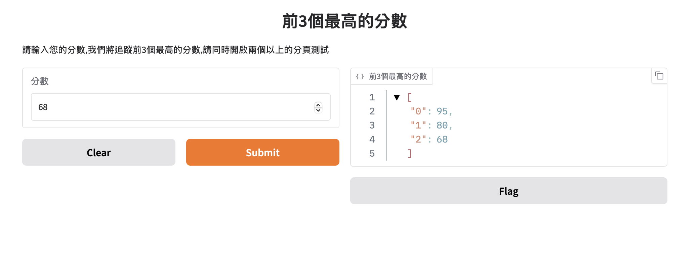
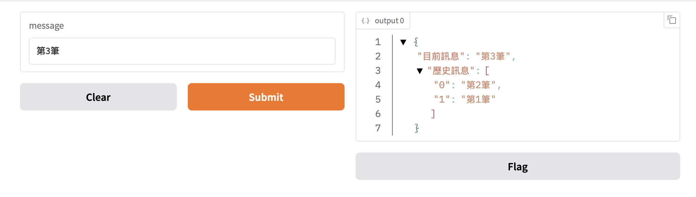

## 保留使用者狀態(Interface State)
保留使用者資訊的方法

### 1. 全域狀態(global state)
如果要建立的變數可以被所有的使用者和function存取,請將變數設定在function的外部,這變數將可以被所有的function內的程式和使用者使用。`假設你要載入一個大語言模型(耗時),你可以建立在function的外部,以便於每一個function和使用者無需再重新載入`

```python
#Global State example
import gradio as gr

scores = []

def track_score(score):
    scores.append(score)
    top_scores = sorted(scores,reverse=True)[:3]
    return top_scores

demo = gr.Interface(
    fn=track_score,
    inputs=gr.Number(label="分數"),
    outputs=gr.JSON(label="前3個最高的分數"),
    title="前3個最高的分數",
    description="請輸入您的分數,我們將追蹤前3個最高的分數,請同時開啟兩個以上的分頁測試",
)

demo.launch()
```




### 2. 使用者狀態(session state)
Gradio 支援的另一種資料持久性類型是會話狀態,資料可以存留在同一頁的多個提交內,資料並不會和其它使用者共享。使用session state必需做3件事

- function最後一個參數要接收想要保存的資料
- function的return,最後一個return要傳出保存的資料
- inputs的最後一個要使用gr.State(value=[]),由於保存的資料是list,value必需使用空的list,output的最後一個要使用gr.State(),接收保存資訊


```python
#session state example

import gradio as gr

def store_message(message:str, history:list[str]):
    output = {
        "目前訊息":message,
        "歷史訊息":history[::-1]
    }
    history.append(message)
    return output, history

demo = gr.Interface(
    fn = store_message,
    inputs = ["textbox", gr.State(value=[])],
    outputs = ["json", gr.State()]
)

demo.launch()

```

