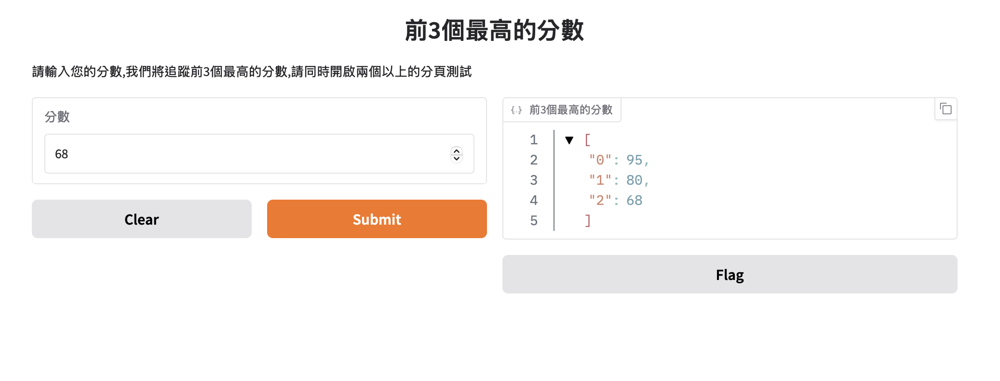
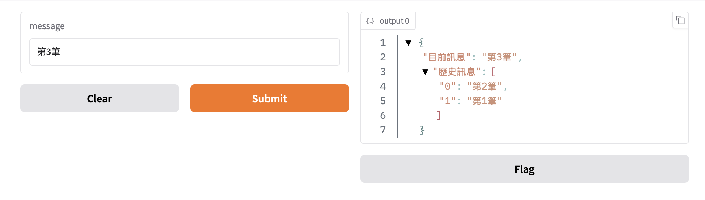

# 💾 保存使用者狀態 (Interface State)

在開發 Web 應用程式時，我們經常需要暫存某些資訊。Gradio 提供兩種主要的狀態保存機制：**全域狀態 (Global State)** 與 **會話狀態 (Session State)**。

---

## 🌐 1. 全域狀態 (Global State)

全域狀態適用於**所有使用者共享**的資料。如果您在函數外部定義變數，該變數將會被所有使用者與所有連線存取與修改。

> [!TIP]
> **常見應用場景：**
> 載入一個耗時的大型語言模型 (LLM) 或機器學習模型。將模型載入程式碼寫在函數外部，這樣不論有多少使用者連線，模型都只會載入一次，避免重複消耗系統資源。

### 範例：全域排行榜 (Global Leaderboard)

以下範例展示如何使用全域狀態追蹤所有使用者提交的最高分數：

```python
import gradio as gr

# 全域變數，所有使用者共享
scores = []

def track_score(score):
    scores.append(score)
    top_scores = sorted(scores, reverse=True)[:3]
    return top_scores

demo = gr.Interface(
    fn=track_score,
    inputs=gr.Number(label="您的分數"),
    outputs=gr.JSON(label="前 3 名最高分數排行榜"),
    title="🏆 全域分數排行榜",
    description="請輸入您的分數！本系統會追蹤所有使用者的前 3 名最高分數。請開啟多個瀏覽器分頁同時測試，觀察資料如何共享。",
)

demo.launch()
```

*執行後的網頁介面如下：*



---

## 🔑 2. 會話狀態 (Session State)

會話狀態（或稱個別使用者狀態）是用來**保存單一瀏覽器分頁（會話）中的資料**。不同分頁之間的資料是完全獨立、互不干涉的。

### 📝 在 Interface 中使用 Session State 的三個關鍵步驟：

1.  **函數參數接收**：核心功能函數的**最後一個參數**必須用來接收要保存的狀態（例如 `history`）。
2.  **函數回傳傳出**：核心功能函數的 **最後一個回傳值** 必須是更新後的狀態資料。
3.  **組件配置綁定**：
    *   在 `inputs` 的**最後一個元素**傳入 `gr.State(value=...)` 實例，用來初始化該狀態（例如以 `value=[]` 初始化一個空的清單）。
    *   在 `outputs` 的**最後一個元素**傳入 `gr.State()` 實例，用來接收並更新該狀態。

### 範例：個人歷史訊息紀錄 (History Tracker)

以下範例展示如何記錄個別使用者的歷史訊息：

```python
import gradio as gr

# history 參數會從 gr.State(value=[]) 傳入
def store_message(message: str, history: list[str]):
    output = {
        "目前訊息": message,
        "歷史訊息 (倒序展示)": history[::-1]
    }
    history.append(message)
    # 同時回傳 UI 顯示內容與更新後的 history 狀態
    return output, history

demo = gr.Interface(
    fn=store_message,
    # inputs 與 outputs 的最後一個元素必須是 gr.State
    inputs=[
        gr.Textbox(label="請輸入您的訊息", placeholder="在此輸入文字..."), 
        gr.State(value=[])
    ],
    outputs=[
        gr.JSON(label="訊息日誌"), 
        gr.State()
    ],
    title="💬 個人歷史訊息記錄器",
    description="您在此分頁輸入的每一筆訊息都會被暫存在會話狀態中，其他連線的使用者不會看到您的資料。"
)

demo.launch()
```

*執行後的網頁介面如下：*

