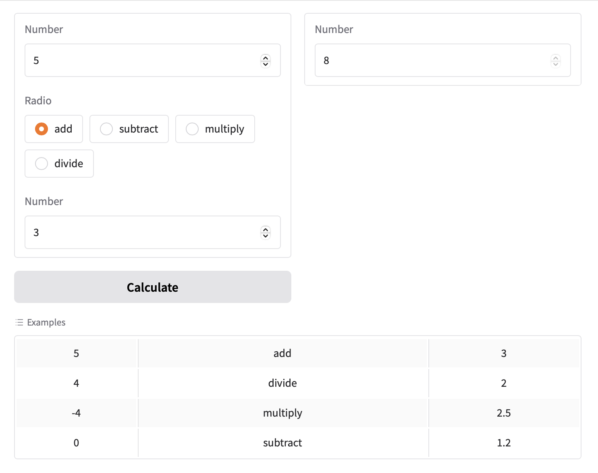
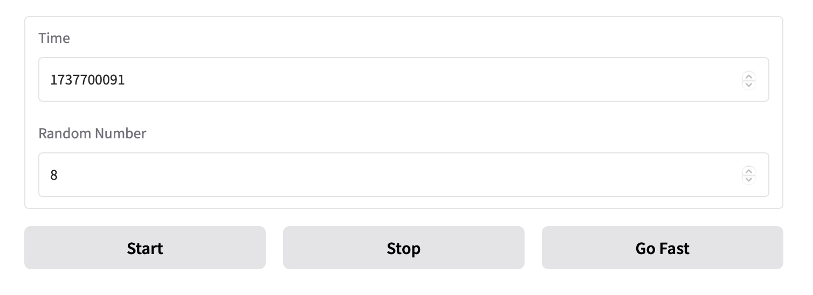
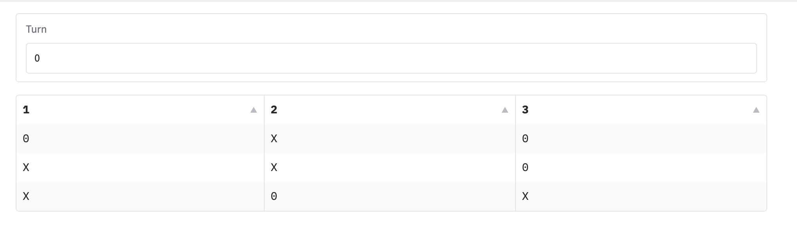

## 更多Blocks的功能

### 範例
```python
import gradio as gr

def calculator(num1, operation, num2):
    if operation == "add":
        return num1 + num2
    elif operation == "subtract":
        return num1 - num2
    elif operation == "multiply":
        return num1 * num2
    elif operation == "divide":
        return num1 / num2

with gr.Blocks() as demo:
    with gr.Row():
        with gr.Column():
            num_1 = gr.Number(value=4)
            operation = gr.Radio(["add", "subtract", "multiply", "divide"])
            num_2 = gr.Number(value=0)
            submit_btn = gr.Button(value="Calculate")
        with gr.Column():
            result = gr.Number()
    
    submit_btn.click(
        calculator, inputs=[num_1, operation, num_2], outputs=[result], api_name=False
    )
    examples = gr.Examples(
        examples = [
            [5, "add", 3],
            [4, "divide", 2],
            [-4, "multiply", 2.5],
            [0, "subtract", 1.2]
        ],
        inputs=[num_1, operation, num_2]
    )

demo.launch(show_api=False)
```



### 接續執行事件
- 可以安排固定一個時間,送出Event fire
- gr.Timer(),tick event

```python
with gr.Blocks() as demo:
	timer = gr.Timer(5)
	textbox = gr.Textbox()
	textbox2 = gr.Textbox()
	timer.tick(set_textbox_fn, textbox, textbox2)
```

**使用component's every=參數**

```python
with gr.Blocks() as demo:
	timer = gr.Timer(5)
	textbox = gr.Textbox()
	texbox2 = gr.Textbox(set_text_fn, inputs=[texbox], every=timer)
```

```python
import gradio as gr
import random
import time

with gr.Blocks() as demo:
    timer = gr.Timer(1)
    timestamp = gr.Number(label="Time")
    timer.tick(lambda: round(time.time()),outputs=timestamp)

    number = gr.Number(lambda: random.randint(1, 10), every=timer, label="Random Number")

    with gr.Row():
        gr.Button("Start").click(lambda:gr.Timer(active=True),None,timer)
        gr.Button("Stop").click(lambda: gr.Timer(active=False), None, timer)
        gr.Button("Go Fast").click(lambda:0.2, None, timer)

demo.launch()
```




### 搜集事件資料(Gathering Event Data)
- 可以透過事件監聽函式的函式參數,可以收集到事件,但函式參數必需要有type hint

- select()可以收集到gradio.SelectData
- 有select()的有Textbox, Image, DataFrame

```python
import gradio as gr

with gr.Blocks() as demo:
    turn = gr.Textbox("X", interactive=False, label="Turn")
    board = gr.Dataframe(value=[["","",""]]*3, interactive=False, type="array")

    def place(board:list[list[int]], turn, evt:gr.SelectData):
        if evt.value:
            return board, turn
        board[evt.index[0]][evt.index[1]] = turn
        turn = "0" if turn == "X" else "X"
        return board, turn
        
    board.select(place,[board, turn],[board, turn], show_progress='hidden')

demo.launch()
```


