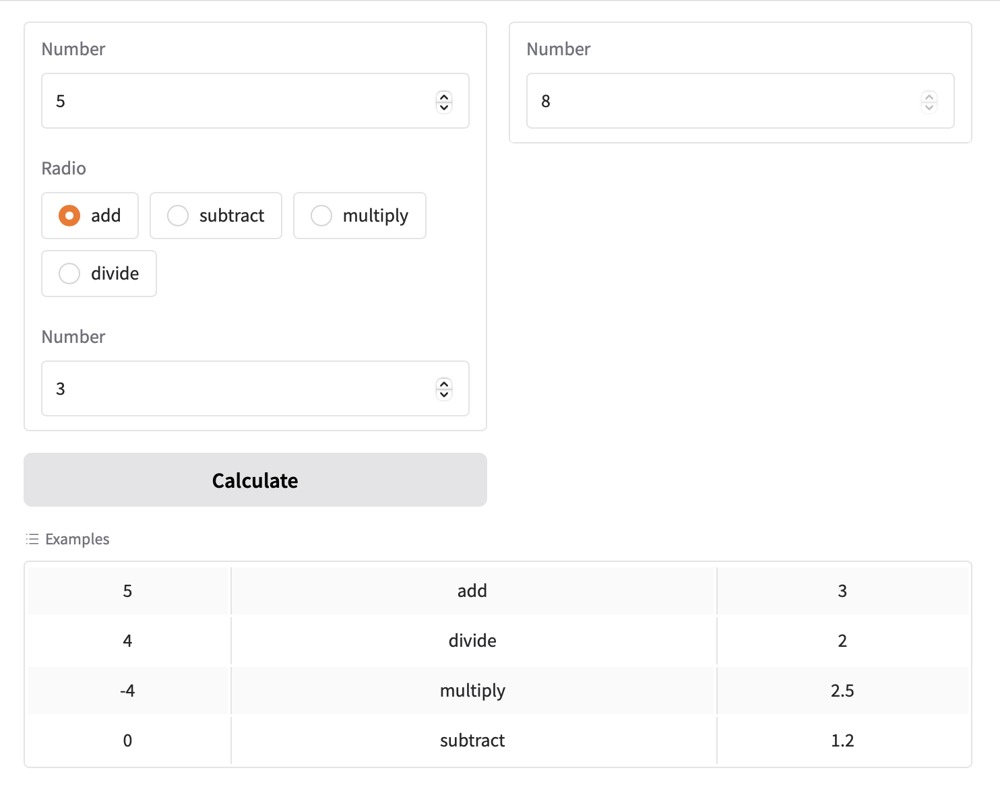
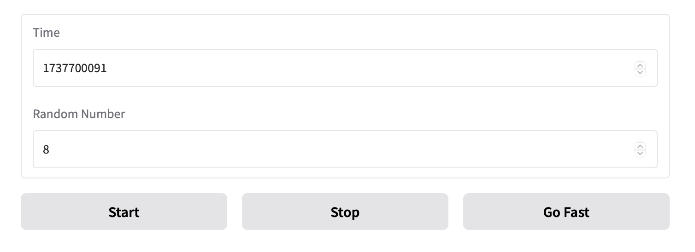
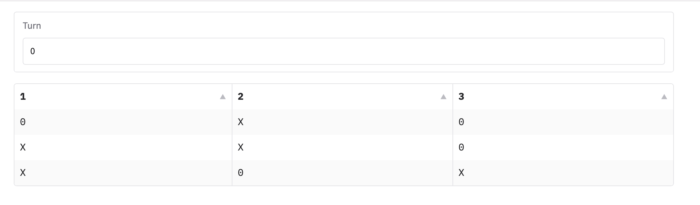

# 🛠️ 更多 Blocks 進階功能

本章節介紹 `gr.Blocks` 的三項實用進階功能：**範例資料綁定 (`gr.Examples`)**、**定時器任務 (`gr.Timer`)**，以及 **資料選擇事件監聽 (`gr.SelectData`)**。

---

## 📋 1. 範例資料綁定 (gr.Examples)

在 Blocks 結構中，您可以使用 `gr.Examples` 來引導使用者填寫輸入。它能與特定的輸入組件綁定，當使用者點選範例時，資料會自動填入對應的輸入框中。

```python
import gradio as gr

def calculator(num1, operation, num2):
    if operation == "加法 (add)":
        return num1 + num2
    elif operation == "減法 (subtract)":
        return num1 - num2
    elif operation == "乘法 (multiply)":
        return num1 * num2
    elif operation == "除法 (divide)":
        return (num1 / num2) if num2 != 0 else "無法除以零"

with gr.Blocks() as demo:
    with gr.Row():
        with gr.Column():
            num_1 = gr.Number(value=4, label="數值 1")
            operation = gr.Radio(["加法 (add)", "減法 (subtract)", "乘法 (multiply)", "除法 (divide)"], label="運算方法")
            num_2 = gr.Number(value=0, label="數值 2")
            submit_btn = gr.Button(value="⚡ 進行計算")
        with gr.Column():
            result = gr.Number(label="運算結果")
    
    submit_btn.click(
        calculator, inputs=[num_1, operation, num_2], outputs=[result], api_name=False
    )
    
    # 建立範例資料區塊
    gr.Examples(
        examples=[
            [5, "加法 (add)", 3],
            [4, "除法 (divide)", 2],
            [-4, "乘法 (multiply)", 2.5],
            [0, "減法 (subtract)", 1.2]
        ],
        inputs=[num_1, operation, num_2]
    )

demo.launch(show_api=False)
```



---

## ⏱️ 2. 定時任務與組件週期更新 (gr.Timer)

`gr.Timer` 是一個隱藏的定時器元件，能夠以固定的時間間隔（單位：秒）重覆執行特定的 Python 函數，特別適合用於即時儀表板、滾動日誌或週期性狀態同步。

### 範例：即時系統時間與每秒隨機數

```python
import gradio as gr
import random
import time

with gr.Blocks() as demo:
    # 建立定時器，每 1 秒觸發一次
    timer = gr.Timer(1)
    
    timestamp = gr.Number(label="⏱️ 當前系統時間戳記")
    # 每秒更新一次時間戳記
    timer.tick(lambda: round(time.time()), outputs=timestamp)

    # every=timer 參數代表元件在該 timer 觸發時自動重新執行其定義的函數
    number = gr.Number(lambda: random.randint(1, 10), every=timer, label="🎲 每秒隨機數 (1-10)")

    with gr.Row():
        gr.Button("▶️ 啟動定時器").click(lambda: gr.Timer(active=True), None, timer)
        gr.Button("⏸️ 停止定時器").click(lambda: gr.Timer(active=False), None, timer)
        gr.Button("⚡ 加速定時器 (0.2s)").click(lambda: 0.2, None, timer)

demo.launch()
```



---

## 📍 3. 收集事件詳細資訊 (gr.SelectData)

藉由為事件監聽函數加上類型標記 `evt: gr.SelectData`，Gradio 會在事件觸發時自動傳入一個 `SelectData` 物件。
您可以從中讀取使用者具體點擊了該組件的**哪一個索引位置 (index)**、**點擊的具體數值 (value)** 等細節資訊。

> [!NOTE]
> 目前支援 `select` 事件監聽的組件包括：`Textbox` (獲取選取的文字)、`Image` (獲取點擊的二維像素座標) 以及 `Dataframe` (獲取點擊的表格單元格行與列)。

### 範例：井字棋盤點擊監聽 (Tic-Tac-Toe)

```python
import gradio as gr

def select_cell(evt: gr.SelectData):
    # evt.index 是一個包含 (列索引, 行索引) 的 tuple
    return f"您點擊了第 {evt.index[0] + 1} 列、第 {evt.index[1] + 1} 行的儲存格 (索引座標: {evt.index})"

with gr.Blocks() as demo:
    turn = gr.Textbox("X", interactive=False, label="👤 當前玩家回合")
    board = gr.Dataframe(value=[["","",""]]*3, interactive=False, type="array")
    selected_cell_output = gr.Textbox(label="📍 您所點擊的儲存格座標")

    # 當點擊棋盤表格時，觸發選擇事件
    board.select(select_cell, None, selected_cell_output)

demo.launch()
```



