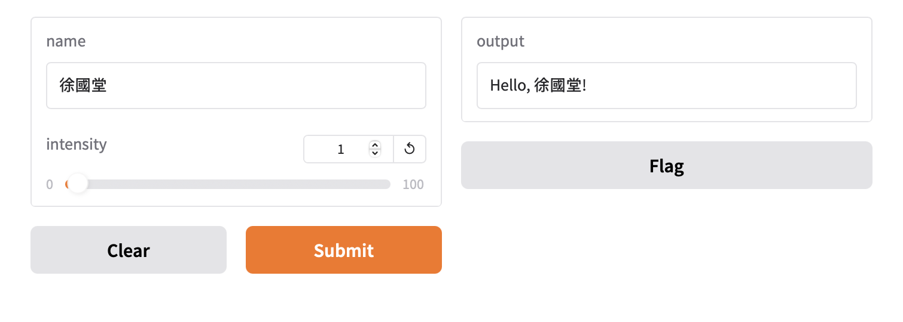
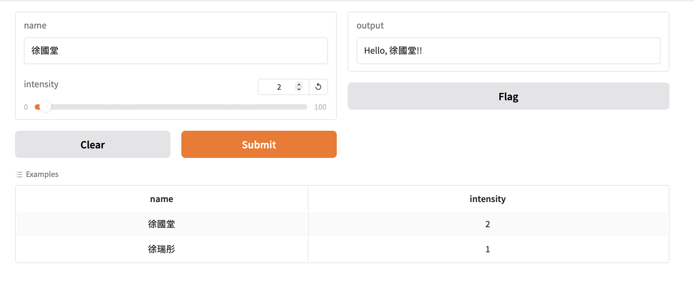
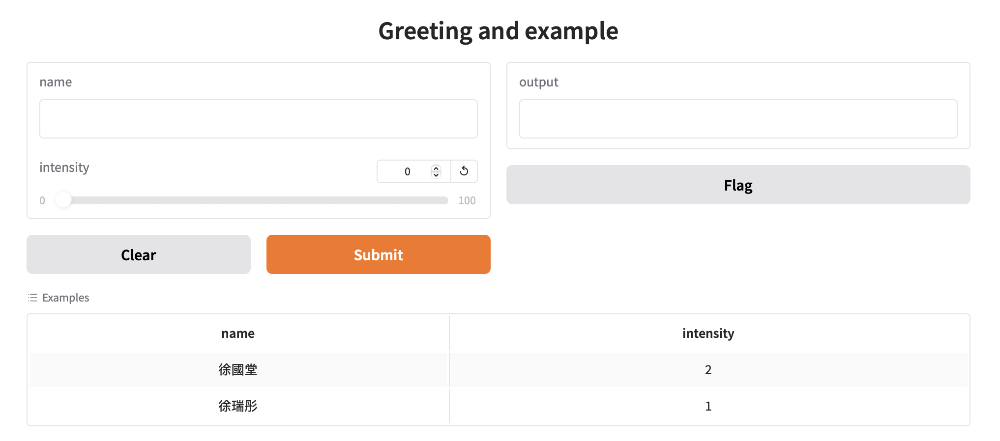

## 快速上手

### 安裝

```
pip install --upgrade gradio
```

### Gradio可在jupyter notebook上安裝

### 建立第一個範例


```python
import gradio as gr

def greet(name, intensity):
    return "Hello, " + name + "!" * int(intensity)

demo = gr.Interface(
    fn=greet,
    inputs=["text", "slider"],
    outputs=["text"],
)

demo.launch()

```

### 執行檔案

```python
python xxx.py
```

### 開發模式執行檔案(Hot Reload mode)

```python
gradio xxx.py
```



### 程式觀念說明
**Interface3個引數名稱**
-fn:使用者介面的功能
-inputs: 用於輸入的 Gradio 組件。組件的數量應該與函數中參數的數量相符。

### 提供範例(examples)
- 提供範例讓使用者知道如何操作
- 提供的list元素順序,依據function參數的順序

```python
import gradio as gr

def greet(name, intensity):
    return "Hello, " + name + "!" * int(intensity)

demo = gr.Interface(
    fn=greet,
    inputs=["text", "slider"],
    outputs=["text"],
    examples = [["徐國堂","2"],["徐瑞彤","1"]]
)
demo.launch()

```



### 增加標題

```python
import gradio as gr

def greet(name, intensity):
    return "Hello, " + name + "!" * int(intensity)

demo = gr.Interface(
    fn=greet,
    inputs=["text", "slider"],
    outputs=["text"],
    examples = [["徐國堂","2"],["徐瑞彤","1"]],
    title="Greeting and example",
)

demo.launch()
```



### Flag的按鈕是使用者如何要保留資訊input的資訊,可以按下Flag,資料將會被儲存並通知開發者