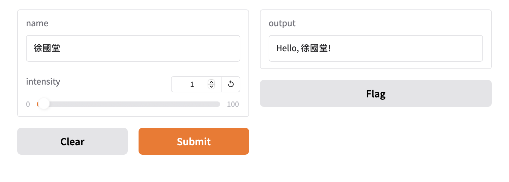
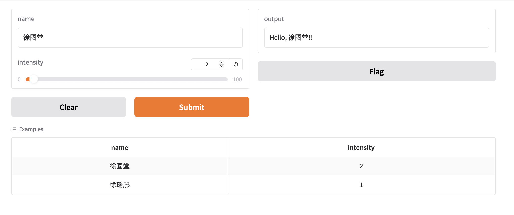
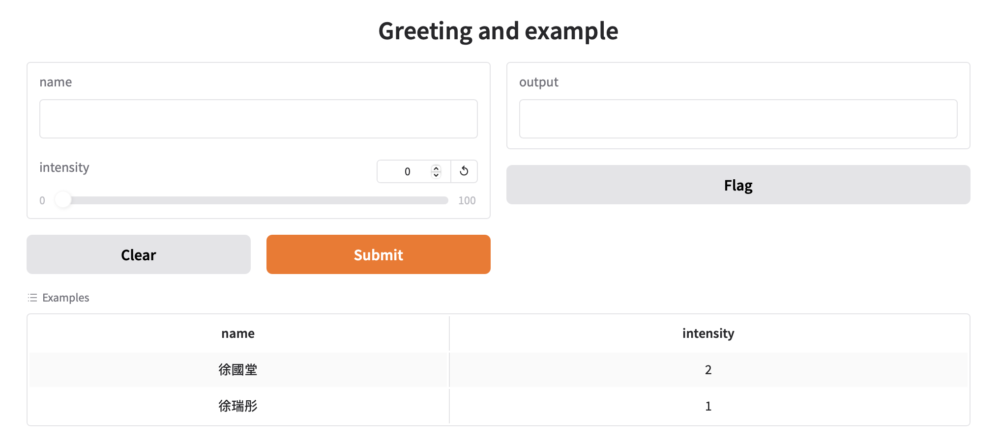

# 🏁 Gradio 快速上手

本章節介紹如何安裝 Gradio，並建立您的第一個互動式介面。

---

## 💾 安裝與環境建立

我們推薦使用現代化且極速的 Python 套件管理工具 **`uv`** 來建立虛擬環境並安裝 Gradio。

### 使用 `uv` (推薦)
```bash
# 建立並啟用虛擬環境
uv venv
source .venv/bin/activate  # Windows 請用 .venv\Scripts\activate

# 安裝 Gradio
uv pip install gradio
```

### 使用傳統 `pip`
```bash
# 建立並啟用虛擬環境
python3 -m venv .venv
source .venv/bin/activate

# 安裝 Gradio
pip install --upgrade gradio
```

> [!TIP]
> Gradio 除了可以作為獨立腳本執行，也完全支援在 Jupyter Notebook、Google Colab 等互動式開發環境中直接嵌入運行。在互動式環境中，您可以使用 `!uv pip install gradio` 或 `!pip install gradio` 進行安裝。


---

## 🛠️ 建立第一個範例

讓我們從一個簡單的「問候產生器」開始。此範例接受使用者輸入名字與問候強度（驚嘆號個數），並產生問候語：

```python
import gradio as gr

def greet(name, intensity):
    return "Hello, " + name + "!" * int(intensity)

# 建立 Interface 實例
demo = gr.Interface(
    fn=greet,
    inputs=["text", "slider"],
    outputs=["text"],
)

demo.launch()
```

### 🚀 執行程式碼

**一般模式：**
如果您已啟用虛擬環境，可直接執行：
```bash
python lesson1.py
```
或者，使用 `uv` 直接在暫存或專案虛擬環境中執行（免手動啟用虛擬環境）：
```bash
uv run python lesson1.py
```

**熱重載開發模式 (Hot Reload Mode)：**
當您在調整 UI 版面時，推薦使用 `gradio` 命令啟動。這能讓您在修改程式碼後，瀏覽器自動重新載入而不需要手動重啟伺服器：
```bash
# 啟用虛擬環境下
gradio lesson1.py

# 使用 uv 直接執行
uv run gradio lesson1.py
```

*執行後的網頁介面如下：*



---

## 💡 核心觀念說明

`gr.Interface` 類別初始化時最核心的三個參數為：

1.  **`fn`**：定義 UI 背後的核心運作邏輯（即您希望使用者操作的 Python 函數）。
2.  **`inputs`**：定義輸入組件。組件的類型與順序應與核心函數 `fn` 的參數一一對應。在此例中分別對應到 `text`（文字框）與 `slider`（滑桿）。
3.  **`outputs`**：定義輸出組件。組件的類型與順序應對應到核心函數 `fn` 的回傳值。

---

## 🌟 進階配置

### 1. 提供範例資料 (Examples)

為了引導使用者輸入，您可以提供預設的範例。範例的列表結構需對應函數參數的順序：

```python
import gradio as gr

def greet(name, intensity):
    return "Hello, " + name + "!" * int(intensity)

demo = gr.Interface(
    fn=greet,
    inputs=["text", "slider"],
    outputs=["text"],
    examples=[["徐國堂", "2"], ["徐瑞彤", "1"]]
)
demo.launch()
```



### 2. 新增標題與描述 (Title & Description)

您可以為您的應用程式加上清晰的標題，使其更具產品感：

```python
import gradio as gr

def greet(name, intensity):
    return "Hello, " + name + "!" * int(intensity)

demo = gr.Interface(
    fn=greet,
    inputs=["text", "slider"],
    outputs=["text"],
    examples=[["徐國堂", "2"], ["徐瑞彤", "1"]],
    title="問候產生器與範例展示",
)

demo.launch()
```



### 3. 資料標記功能 (Flagging)

在 Gradio UI 中，預設會提供一個 **Flag (標記)** 按鈕。
當測試者發現模型產出的結果有錯誤、偏差，或希望保留特定輸入資料時，點擊 **Flag** 會將該筆輸入與輸出資料儲存至本地目錄（預設為 `flagged/` 檔案夾），方便開發者後續下載分析以改進模型。

> [!NOTE]
> 如果您想關閉此按鈕，可以在 `gr.Interface` 中設定 `flagging_options=None`（如 `lesson1.py` 所示）。

### 4. 共享您的應用 (Share)

Gradio 最強大的功能之一，就是只需加入一個參數，即可產生一個公網可存取的臨時連結（有效期為 72 小時），讓您可以輕鬆與團隊分享模型成果：

```python
import gradio as gr

def greet(name, intensity):
    return "Hello, " + name + "!" * int(intensity)

demo = gr.Interface(
    fn=greet,
    inputs=["text", "slider"],
    outputs=["text"],
    examples=[["徐國堂", "2"], ["徐瑞彤", "1"]]
)
# 啟動時開啟分享功能 🚀
demo.launch(share=True)
```
 

