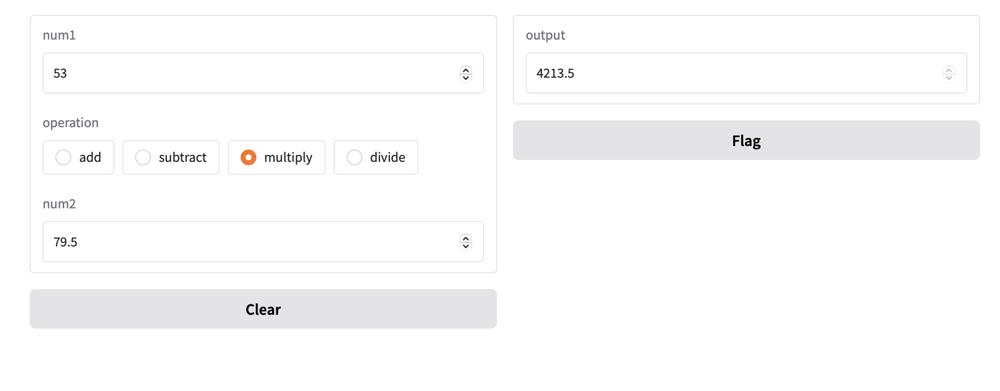

## 2種回應介面(Reactive Interfaces)
- **及時介面(Live Interface)**

	當改變數值是,自動更新介面(不用按submit)
	
```python
	#Live Interfaces

import gradio as gr

def calculator(num1, operation, num2):
    if operation == "add":
        return num1 + num2
    elif operation == "subtract":
        return num1 - num2
    elif operation == "multiply":
        return num1 * num2
    elif operation == "divide":
        return num1 / num2
    
demo = gr.Interface(
    fn=calculator,
    inputs=[
        "number",
        gr.Radio(["add", "subtract", "multiply", "divide"]),
        "number"
    ],
    outputs="number",
    live=True
)

demo.launch()


```
	


- **串流介面(streaming Interface)**
	- 


