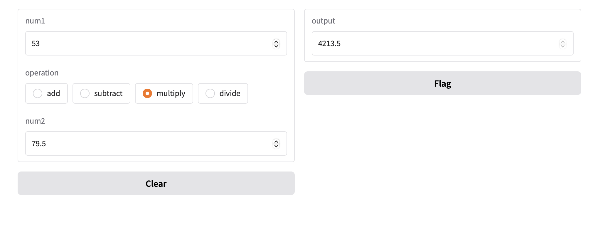
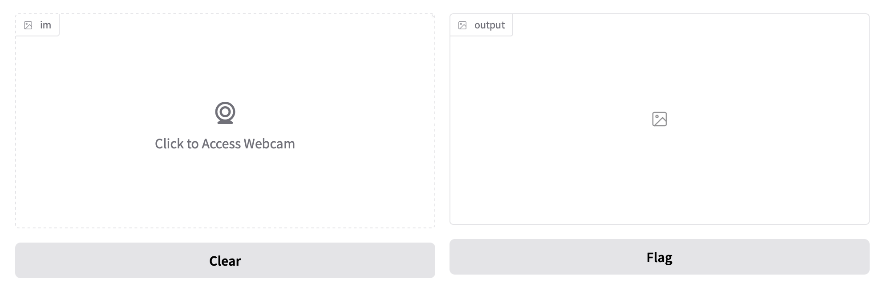

# ⚡ 即時與串流回應介面 (Reactive Interfaces)

預設情況下，Gradio 應用程式需要使用者點擊「Submit (送出)」按鈕後才會執行背後的函數並更新輸出。但藉由配置 `live=True`，我們可以打造更直覺的即時回應介面。

---

## 🟢 1. 即時介面 (Live Interface)

當您將 `live` 參數設定為 `True` 時，只要輸入元件的值發生任何改變，應用程式就會**自動、即時地**呼叫函數並更新輸出介面，完全不需要額外點擊送出按鈕。

### 範例：即時計算機 (Live Calculator)

```python
import gradio as gr

def calculator(num1, operation, num2):
    if operation == "add":
        return num1 + num2
    elif operation == "subtract":
        return num1 - num2
    elif operation == "multiply":
        return num1 * num2
    elif operation == "divide":
        return (num1 / num2) if num2 != 0 else "無法除以零"

demo = gr.Interface(
    fn=calculator,
    inputs=[
        gr.Number(label="數值 1", value=0),
        gr.Radio(["add", "subtract", "multiply", "divide"], label="運算方法"),
        gr.Number(label="數值 2", value=0)
    ],
    outputs=gr.Number(label="計算結果"),
    live=True # 開啟即時更新功能
)

demo.launch()
```

*執行後的網頁介面如下：*



---

## 🎙️ 2. 串流介面 (Streaming Interface)

串流介面是即時介面的一種特別延伸，最常應用在**連續性輸入**的場景，例如：
- 麥克風音訊的連續輸入 (`gr.Audio`)
- 網路攝影機 (Webcam) 的視訊串流 (`gr.Image`)

當串流屬性 `streaming=True` 與 `live=True` 同時啟用時，Gradio 會在背景以極高頻率（例如每秒數次）連續將資料塊（data frames）送往 Python 函數，並將實時處理完後的影像或音訊同步更新在畫面上。

### 範例：視訊影像上下反轉 (Webcam Frame Flip)

```python
import gradio as gr
import numpy as np

def flip(im):
    # 將影像矩陣上下反轉
    return np.flipud(im) if im is not None else None

demo = gr.Interface(
    fn=flip,
    # sources=["webcam"] 指定輸入源為網路攝影機，streaming=True 開啟串流
    inputs=gr.Image(sources=["webcam"], streaming=True),
    outputs=gr.Image(label="處理後影像"),
    live=True
)

demo.launch()
```

*執行後的網頁介面如下：*




