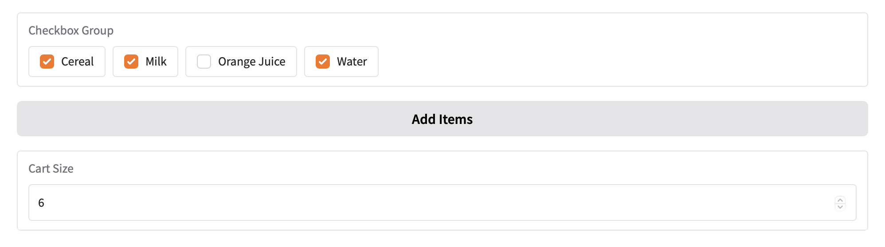
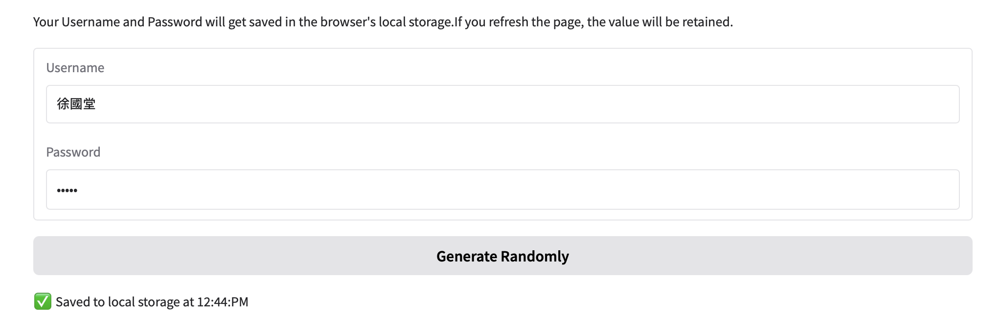

## 保存Blocks State

### Global State
- 就是python文件變數
- 分享給所有的使用者和function

### Session State
Gradio 支援會話狀態，其中資料在頁面會話中的多次提交中仍然存在，在 Blocks 應用程式中也是如此,session state不會分享給其它使用者, 儲存資料在session state,必需做3件事

- 在Blocks context內建立gr.State()實體, 如果這實體需要有default值,建立時就將default值加入
- 在事件監聽器內,依據需要,將它放在inputs或outputs
- 在事件監聽器函式內,接收或傳遞


```python
# Session State in block

import gradio as gr

with gr.Blocks() as demo:
    cart = gr.State([])
    items_to_add = gr.CheckboxGroup(["Cereal", "Milk", "Orange Juice", "Water"])

    def add_item(new_items, previous_cart):
        cart = previous_cart + new_items
        return cart
    
    gr.Button("Add Items").click(
        fn = add_item,
        inputs = [items_to_add, cart],
        outputs = cart
    )

    cart_size = gr.Number(label="Cart Size")
    cart.change(lambda cart: len(cart), inputs=cart, outputs=cart_size)

demo.launch()
```



## Local State
- 儲存在本地端的瀏灠器內,頁面reload或頁面關閉依舊保存著
- gr.BrowserState()

```python
#Local State

import random
import string
import gradio as gr
import time

with gr.Blocks() as demo:
    gr.Markdown("Your Username and Password will get saved in the browser's local storage."
                "If you refresh the page, the value will be retained.")
    username = gr.Textbox(label="Username")
    password = gr.Textbox(label="Password", type="password")
    btn = gr.Button("Generate Randomly")
    local_storage = gr.BrowserState(["", ""])
    saved_message = gr.Markdown("✅ Saved to local storage", visible=False)

    @btn.click(outputs=[username, password])
    def generate_randomly():
        u = "".join(random.choices(string.ascii_letters + string.digits, k=10))
        p = "".join(random.choices(string.ascii_letters + string.digits, k=10))
        return u, p
    
    @demo.load(inputs=[local_storage], outputs=[username, password])
    def load_from_local_storage(saved_values):
        print("loading from local storage", saved_values)
        return saved_values[0], saved_values[1]
    
    @gr.on([username.change, password.change],
            inputs=[username, password],
            outputs=[local_storage])
    def save_to_local_storage(username, password):
        return [username, password]
    
    @gr.on(local_storage.change, outputs=[saved_message])
    def show_saved_message():
        timestamp = time.strftime("%I:%M:%p")
        return gr.Markdown(
            f"✅ Saved to local storage at {timestamp}",
            visible=True
        )

demo.launch()

```

