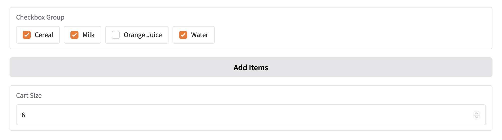
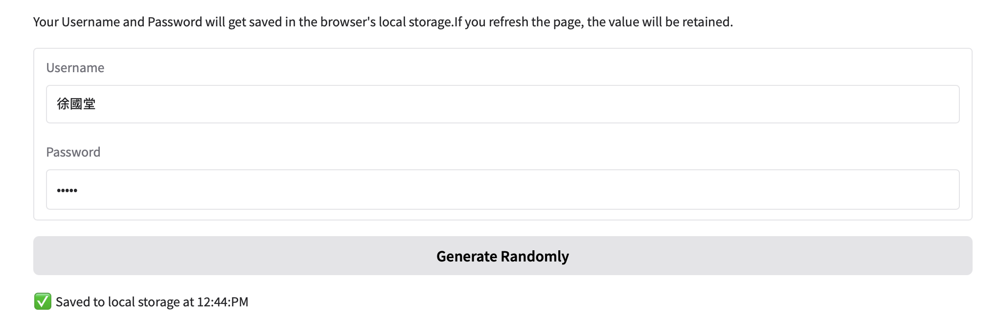

# 💾 保存 Blocks 狀態 (State in Blocks)

在 `gr.Blocks` 架構下，Gradio 同樣支援在多次事件提交之間保存臨時狀態，主要包括：**會話狀態 (Session State)** 與 **瀏覽器本地狀態 (Local State)**。

---

## 🟢 1. 會話狀態 (Session State)

會話狀態用於在單一分頁會話（Session）中儲存暫存資料。資料**不會**在不同使用者或不同瀏覽器分頁之間共享。

### 📝 在 Blocks 中使用 Session State 的步驟：
1.  在 Blocks 上下文內，使用 `gr.State(value=...)` 建立狀態元件，並可指定初始預設值（例如空清單 `[]`）。
2.  將該狀態元件作為 inputs 傳入事件監聽器，同時作為 outputs 接收更新後的值。
3.  在事件函數中，接收舊的狀態，處理後回傳新的狀態。

### 範例：購物車功能 (Shopping Cart)

```python
import gradio as gr

with gr.Blocks() as demo:
    # 1. 建立 Session 狀態元件，預設為空清單 []
    cart = gr.State([])
    
    items_to_add = gr.CheckboxGroup(
        ["麥片 (Cereal)", "牛奶 (Milk)", "柳橙汁 (Orange Juice)", "礦泉水 (Water)"],
        label="選擇商品"
    )
    add_btn = gr.Button("🛒 加入購物車")

    # 2. 定義加入購物車的邏輯
    def add_item(new_items, previous_cart):
        updated_cart = previous_cart + new_items
        return updated_cart
    
    # 3. 綁定事件：將選取的商品與購物車狀態傳入，並更新購物車狀態
    add_btn.click(
        fn=add_item,
        inputs=[items_to_add, cart],
        outputs=cart
    )

    cart_size = gr.Number(label="購物車內商品總數", value=0)
    
    # 監聽狀態改變事件：當購物車狀態改變時，更新顯示數量
    cart.change(lambda current_cart: len(current_cart), inputs=cart, outputs=cart_size)

demo.launch()
```

*執行後的網頁介面如下：*



---

## 🌐 2. 瀏覽器本地狀態 (Local Storage State)

本地狀態是藉由瀏覽器的 **Local Storage** 實現的。即使使用者**重新整理頁面**或**關閉瀏覽器後重新開啟**，儲存的資料依然會被完整保留。

Gradio 提供 `gr.BrowserState` 組件來支援本地儲存：

### 範例：自動保存帳號密碼至瀏覽器

```python
import random
import string
import gradio as gr
import time

with gr.Blocks() as demo:
    gr.Markdown("### 🔒 本地帳密儲存器\n您的帳號和密碼將會自動儲存於瀏覽器的本地儲存空間 (Local Storage)。重新整理頁面後，欄位內容依然會被保留。")
    
    username = gr.Textbox(label="帳號名稱")
    password = gr.Textbox(label="密碼密鑰", type="password")
    btn = gr.Button("🎲 隨機產生帳密")
    
    # 建立 BrowserState，用來持久化儲存帳號與密碼 (格式為 [帳號, 密碼])
    local_storage = gr.BrowserState(["", ""])
    saved_message = gr.Markdown("✅ 已儲存至本地瀏覽器", visible=False)

    # 1. 隨機產生測試帳密
    @btn.click(outputs=[username, password])
    def generate_randomly():
        u = "".join(random.choices(string.ascii_letters + string.digits, k=10))
        p = "".join(random.choices(string.ascii_letters + string.digits, k=10))
        return u, p
    
    # 2. 當頁面載入 (demo.load) 時，自動從 local storage 讀取舊資料並填入
    @demo.load(inputs=[local_storage], outputs=[username, password])
    def load_from_local_storage(saved_values):
        print("正在從瀏覽器 Local Storage 載入：", saved_values)
        return saved_values[0], saved_values[1]
    
    # 3. 當帳號或密碼欄位值改變時，自動更新並保存至 local storage
    @gr.on([username.change, password.change],
            inputs=[username, password],
            outputs=[local_storage])
    def save_to_local_storage(u, p):
        return [u, p]
    
    # 4. 當儲存狀態改變時，顯示帶有時間戳記的保存提示訊息
    @gr.on(local_storage.change, outputs=[saved_message])
    def show_saved_message():
        timestamp = time.strftime("%H:%M:%S")
        return gr.Markdown(
            f"✅ 已於 {timestamp} 成功自動保存至本地儲存區",
            visible=True
        )

demo.launch()
```

*執行後的網頁介面如下：*

