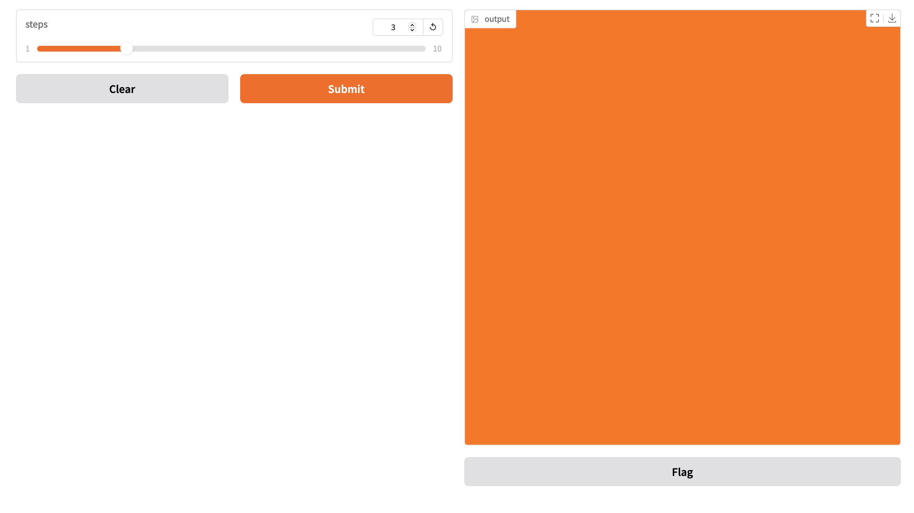

## 串流輸出(Streaming outputs)

在一些案例中,不想等到全部的資料收集齊全後才一次一起輸出(需要花費一些時間),這時會想使用收集多少就先輸出多少。例如你想要一個照片產生器的模型,但想要看到每一個階段顯示的外觀,最終才看到所有的圖片。或您有一個聊天機器人,你想要看到一個字一個字的顯示,而不是一次顯示全部(因為會花費幾秒的時間)

如果遇到這種狀況,必需使用python的generator函式取代事件監聽器的函式。非常簡單只要把return換成yield

```
def my_generator(x):
	for i in range(x):
		yield i
```

```python
import gradio as gr
import numpy as np
import time

def fake_diffusion(steps):
    rng = np.random.default_rng()
    for i in range(steps):
        time.sleep(1)
        image = rng.random(size=(600, 600, 3))
        yield image
    image = np.ones((1000,1000,3), np.uint8)
    image[:] = [255, 124, 0]
    yield image

demo = gr.Interface(fake_diffusion,
                    inputs=gr.Slider(1, 10, 3, step=1),
                    outputs="image")

demo.launch()
```




### streaming Audio

```python
import gradio as gr
from time import sleep

def keep_repeating(audio_file):
    for _ in range(10):
        sleep(0.5)
        yield audio_file

gr.Interface(keep_repeating,
             gr.Audio(sources=["microphone"], type="filepath"),
             gr.Audio(streaming=True, autoplay=True)
).launch()
```

### streaming Video

```
import gradio as gr
from time import sleep

def keep_repeating(video_file):
    for _ in range(10):
        sleep(0.5)
        yield video_file

gr.Interface(keep_repeating,
             gr.Video(sources=["webcam"], format="mp4"),
             gr.Video(streaming=True, autoplay=True)
).launch()
```
