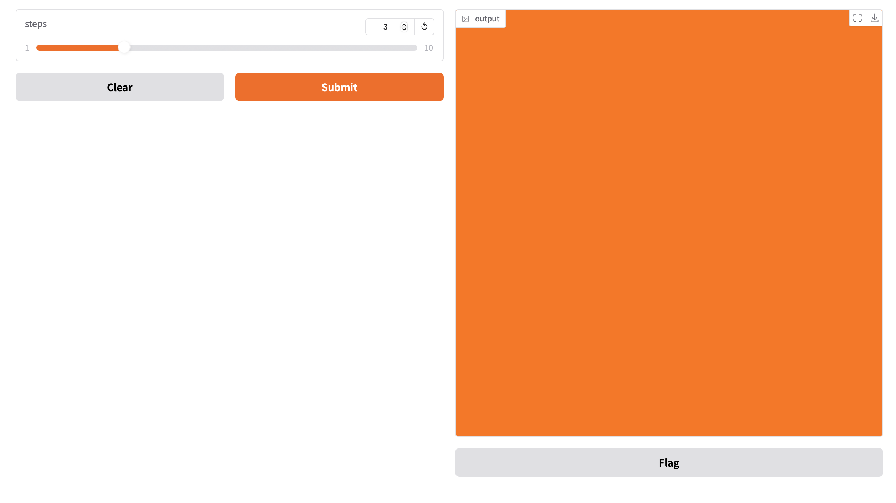

# 🌊 串流輸出 (Streaming Outputs)

在許多應用情境中（例如影像生成模型或 LLM 聊天機器人），因為完整生成結果可能需要花費數秒甚至數分鐘，我們通常不希望使用者在畫面前枯等。此時，**串流輸出 (Streaming)** 可以實現「生成多少，立即顯示多少」的流暢體驗。

> [!TIP]
> **運作機制：**
> 在 Python 中，您只需要使用 **Generator (產生器) 函數** 取代一般的函數，並將 `return` 關鍵字改用 **`yield`** 即可。Gradio 偵測到 Generator 時，會自動建立串流通道，即時在 UI 畫面上渲染每一次 `yield` 吐出的資料。

---

## 🟢 1. 影像串流輸出 (Image Streaming)

以下範例模擬 Diffusion（擴散）影像生成過程，每秒鐘輸出一個雜訊逐步收斂的影像，最終呈現完整的彩色畫面：

```python
import gradio as gr
import numpy as np
import time

def fake_diffusion(steps):
    rng = np.random.default_rng()
    for i in range(steps):
        time.sleep(0.5) # 模擬生成延遲
        # 產生隨機雜訊影像
        image = rng.random(size=(600, 600, 3))
        yield image # 即時串流傳回目前的圖像
    
    # 最終輸出一個純橘色的影像
    final_image = np.ones((1000, 1000, 3), np.uint8)
    final_image[:] = [255, 124, 0]
    yield final_image

demo = gr.Interface(
    fn=fake_diffusion,
    inputs=gr.Slider(1, 10, value=3, step=1, label="擴散生成步數 (Steps)"),
    outputs=gr.Image(label="即時渲染結果"),
    title="🎨 模擬擴散影像生成器"
)

demo.launch()
```

*執行後的網頁介面如下：*



---

## 🎙️ 2. 音訊串流輸出 (Audio Streaming)

透過 `gr.Audio`，您可以實時將麥克風接收的聲音切片（Audio Frames）傳送到後端進行處理，或將處理後的音訊串流播放：

```python
import gradio as gr
from time import sleep

def keep_repeating(audio_file):
    # 模擬重複播放輸入的音訊 10 次
    for _ in range(10):
        sleep(0.5)
        yield audio_file

demo = gr.Interface(
    fn=keep_repeating,
    inputs=gr.Audio(sources=["microphone"], type="filepath", label="請錄製您的聲音"),
    outputs=gr.Audio(streaming=True, autoplay=True, label="即時播放結果")
)

demo.launch()
```

---

## 📹 3. 視訊串流輸出 (Video Streaming)

同理，對於影像串流，可以藉由 `gr.Video(streaming=True)` 來實時向網頁推送處理後的視訊畫面：

```python
import gradio as gr
from time import sleep

def keep_repeating(video_file):
    # 模擬重複播放視訊 10 次
    for _ in range(10):
        sleep(0.5)
        yield video_file

demo = gr.Interface(
    fn=keep_repeating,
    inputs=gr.Video(sources=["webcam"], format="mp4", label="請開啟 Webcam 錄製視訊"),
    outputs=gr.Video(streaming=True, autoplay=True, label="即時播放結果")
)

demo.launch()
```
